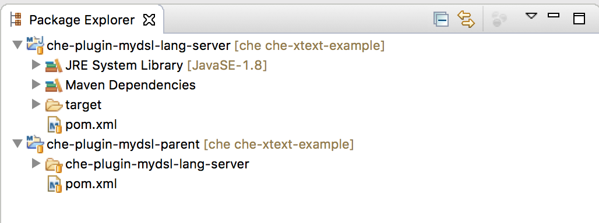
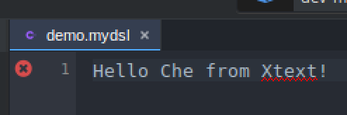

# Getting started with Xtext Language Servers and Che

[Eclipse Che](http://www.eclipse.org/che/) 5 has support for the [Microsoft Language Server Protocol](https://github.com/Microsoft/language-server-protocol) and so has [Eclipse Xtext](https://www.eclipse.org/Xtext/) in its new Version 2.11. So let us see how be can bring both together.

## Provide the Xtext Language Server

The first step is to prepare the Xtext Langauge Server. We create a new Xtext Project using the wizard in Eclipse. We deselect `Eclipse` and choose `Gradle` as Buildsystem. We create a very simple example grammar.

```
Model:
    greetings+=Greeting*;
    
Greeting:
'Hello' name=ID ('from' from=[Greeting])? '!';
```

We will use the gradle application plugin to package our DSL as an executable package. Therefore we edit `org.xtext.example.mydsl.ide/build.gradle` and add the following code.

```
apply plugin: 'application'
mainClassName = "org.eclipse.xtext.ide.server.ServerLauncher"

distributions {
    main {
        baseName = 'mydsl'
    }
}

distZip {
    archiveName "mydsl.zip"
}

distTar {
    archiveName "mydsl.tar"
}
```

We don't need to code anything to make the DSL Language Server enabled. The real interesting part is the `org.eclipse.xtext.ide.server.ServerLauncher` main class. This is a class shipped with Xtext that enables Language Server support. 

We build the projects with gradle.

```
./gradlew clean build distZip
```

Inside the `org.xtext.example.mydsl.parent/org.xtext.example.mydsl.ide/build/distributions` folder we now can find tar/zip files that we can provide via a webserver so that it later can be pulled from Che.

You can find my prepared version [here](http://cdietrich.github.io/mydsl.tar)

## Build a custom "Che with Xtext" Plugin

The second step is to add a new Che Plugin that uses our Xtext Lanuage Server to provide editing support for `mydsl` files.

### Get the Che Source Code

We clone the Che git repository and create a new branch from the latest release tag.

```
https://github.com/eclipse/che.git
cd che
git checkout -b che-xtext-example 5.1.2
```

### Create the Che Plugin

We need to create a plugin that tells Che how to start our Language Server and what the file-extension is.

First we create a bunch of folders and pom files.

```
cd plugins
mkdir plugin-mydsl
cd plugin-mydsl
touch pom.xml
mkdir che-plugin-mydsl-lang-server
cd che-plugin-mydsl-lang-server
touch pom.xml
```

Here is how the `plugin-mydsl/pom.xml` looks like.

```
<?xml version="1.0" encoding="UTF-8"?>
<project xmlns="http://maven.apache.org/POM/4.0.0" xmlns:xsi="http://www.w3.org/2001/XMLSchema-instance" xsi:schemaLocation="http://maven.apache.org/POM/4.0.0 http://maven.apache.org/maven-v4_0_0.xsd">
    <modelVersion>4.0.0</modelVersion>
    <parent>
        <artifactId>che-plugin-parent</artifactId>
        <groupId>org.eclipse.che.plugin</groupId>
        <version>5.1.2</version>
        <relativePath>../pom.xml</relativePath>
    </parent>
    <artifactId>che-plugin-mydsl-parent</artifactId>
    <packaging>pom</packaging>
    <name>Che Plugin :: MyDsl (Xtext) :: Parent</name>
    <modules>
        <module>che-plugin-mydsl-lang-server</module>
    </modules>
    <build>
        <pluginManagement>
            <plugins>
                <plugin>
                    <groupId>org.eclipse.che.core</groupId>
                    <artifactId>che-core-api-dto-maven-plugin</artifactId>
                    <version>${project.version}</version>
                </plugin>
            </plugins>
        </pluginManagement>
    </build>
</project>

```

And here is how the `plugin-mydsl/che-plugin-mydsl-lang-server/pom.xml` looks like.

```
<?xml version="1.0" encoding="UTF-8"?>
<project xmlns="http://maven.apache.org/POM/4.0.0" xmlns:xsi="http://www.w3.org/2001/XMLSchema-instance" xsi:schemaLocation="http://maven.apache.org/POM/4.0.0 http://maven.apache.org/xsd/maven-4.0.0.xsd">
    <modelVersion>4.0.0</modelVersion>
    <parent>
        <artifactId>che-plugin-mydsl-parent</artifactId>
        <groupId>org.eclipse.che.plugin</groupId>
        <version>5.1.2</version>
    </parent>
    <artifactId>che-plugin-mydsl-lang-server</artifactId>
    <name>Che Plugin :: MyDsl (Xtext) :: Extension Server</name>
    <properties>
        <findbugs.failonerror>false</findbugs.failonerror>
    </properties>
    <dependencies>
        <dependency>
            <groupId>com.google.guava</groupId>
            <artifactId>guava</artifactId>
        </dependency>
        <dependency>
            <groupId>com.google.inject</groupId>
            <artifactId>guice</artifactId>
        </dependency>
        <dependency>
            <groupId>com.google.inject.extensions</groupId>
            <artifactId>guice-multibindings</artifactId>
        </dependency>
        <dependency>
            <groupId>io.typefox.lsapi</groupId>
            <artifactId>io.typefox.lsapi.services</artifactId>
        </dependency>
        <dependency>
            <groupId>org.eclipse.che.core</groupId>
            <artifactId>che-core-api-core</artifactId>
        </dependency>
        <dependency>
            <groupId>org.eclipse.che.core</groupId>
            <artifactId>che-core-api-languageserver</artifactId>
        </dependency>
        <dependency>
            <groupId>org.eclipse.che.core</groupId>
            <artifactId>che-core-api-languageserver-shared</artifactId>
        </dependency>
        <dependency>
            <groupId>org.eclipse.che.core</groupId>
            <artifactId>che-core-api-project</artifactId>
        </dependency>
        <dependency>
            <groupId>org.eclipse.che.core</groupId>
            <artifactId>che-core-commons-inject</artifactId>
        </dependency>
        <dependency>
            <groupId>org.eclipse.che.core</groupId>
            <artifactId>che-core-commons-lang</artifactId>
        </dependency>
        <dependency>
            <groupId>org.slf4j</groupId>
            <artifactId>slf4j-api</artifactId>
        </dependency>
    </dependencies>
</project>
```

We register our plugin in the existing `plugins/pom.xml`

```
...
 <module>plugin-csharp</module>
 <!-- this line is the new entry -->
 <module>plugin-mydsl</module>
 <module>plugin-nodejs</module>
...
```

And (including its version) inside the root-pom of Che (`/pom.xml`).

```
<dependency>
    <groupId>org.eclipse.che.plugin</groupId>
    <artifactId>che-plugin-maven-shared</artifactId>
    <version>${che.version}</version>
</dependency>
<!-- this is the new Entry -->
<dependency>
    <groupId>org.eclipse.che.plugin</groupId>
    <artifactId>che-plugin-mydsl-lang-server</artifactId>
    <version>${che.version}</version>
</dependency>
<dependency>
    <groupId>org.eclipse.che.plugin</groupId>
    <artifactId>che-plugin-nodejs-debugger-ide</artifactId>
    <version>${che.version}</version>
</dependency>
```

And we have to package it into the `assembly-wsagent` war (`assembly/assembly-wsagent-war/pom.xml`).

```
<dependency>
    <groupId>org.eclipse.che.plugin</groupId>
    <artifactId>che-plugin-maven-server</artifactId>
</dependency>
<!-- this is the new entry -->
<dependency>
    <groupId>org.eclipse.che.plugin</groupId>
    <artifactId>che-plugin-mydsl-lang-server</artifactId>
</dependency>
<dependency>
    <groupId>org.eclipse.che.plugin</groupId>
    <artifactId>che-plugin-nodejs-debugger-server</artifactId>
</dependency>
```

### Implement the Code

Now that we have prepared the infrastructure we can start to write the actual plugin code. The easiest way (at least for me) is to import our plugin into eclipse (as maven projects) so that we can write the plugin-code. This should look like this



We need to create some Java classes to hook into Che

The first one is `org.eclipse.che.plugin.mydsl.languageserver.MyDslLanguageServerLauncher`

```
package org.eclipse.che.plugin.mydsl.languageserver;

import static java.util.Arrays.asList;

import java.io.IOException;
import java.nio.file.Files;
import java.nio.file.Path;
import java.nio.file.Paths;

import org.eclipse.che.api.languageserver.exception.LanguageServerException;
import org.eclipse.che.api.languageserver.launcher.LanguageServerLauncherTemplate;
import org.eclipse.che.api.languageserver.shared.model.LanguageDescription;
import org.eclipse.che.api.languageserver.shared.model.impl.LanguageDescriptionImpl;

import com.google.inject.Inject;
import com.google.inject.Singleton;

import io.typefox.lsapi.services.json.JsonBasedLanguageServer;

/**
 * @author Christian Dietrich
 */
@SuppressWarnings("deprecation")
@Singleton
public class MyDslLanguageServerLauncher extends LanguageServerLauncherTemplate {

    private static final String   LANGUAGE_ID = "mydsl";
    private static final String[] EXTENSIONS  = new String[] {"mydsl"};
    private static final String[] MIME_TYPES  = new String[] {"text/x-mydsl"};
    private static final LanguageDescriptionImpl description;

    private final Path launchScript;

    static {
        description = new LanguageDescriptionImpl();
        description.setFileExtensions(asList(EXTENSIONS));
        description.setLanguageId(LANGUAGE_ID);
        description.setMimeTypes(asList(MIME_TYPES));
    }

    @Inject
    public MyDslLanguageServerLauncher() {
        launchScript = Paths.get(System.getenv("HOME"), "che/ls-mydsl/mydsl/bin/mydsl-standalone");
    }

    @Override
    public LanguageDescription getLanguageDescription() {
        return description;
    }

    @Override
    public boolean isAbleToLaunch() {
        return Files.exists(launchScript);
    }

    protected JsonBasedLanguageServer connectToLanguageServer(Process languageServerProcess) {
        JsonBasedLanguageServer languageServer = new JsonBasedLanguageServer();
        languageServer.connect(languageServerProcess.getInputStream(), languageServerProcess.getOutputStream());
        return languageServer;
    }

    protected Process startLanguageServerProcess(String projectPath) throws LanguageServerException {
        ProcessBuilder processBuilder = new ProcessBuilder(launchScript.toString());
        processBuilder.redirectInput(ProcessBuilder.Redirect.PIPE);
        processBuilder.redirectOutput(ProcessBuilder.Redirect.PIPE);
        try {
            return processBuilder.start();
        } catch (IOException e) {
            throw new LanguageServerException("Can't start JSON language server", e);
        }
    }
}
```

There are two interesting things only. The `LanguageDescription` which tells Che what the language id, file extensions etc are and the `startLanguageServerProcess` method that creates a new process for our language server calling a launch script and wires the stdin/stdout of the child process.

And we need to register the launcher class to Che via a new `DynaModule`.

```
package org.eclipse.che.plugin.mydsl.inject;

import com.google.inject.AbstractModule;
import com.google.inject.multibindings.Multibinder;

import org.eclipse.che.inject.DynaModule;
import org.eclipse.che.plugin.mydsl.languageserver.MyDslLanguageServerLauncher;
import org.eclipse.che.api.languageserver.launcher.LanguageServerLauncher;

/**
 * @author Christian Dietrich
 */
@DynaModule
public class MyDslModule extends AbstractModule {
    @Override
    protected void configure() {
        Multibinder.newSetBinder(binder(), LanguageServerLauncher.class).addBinding().to(MyDslLanguageServerLauncher.class);
    }
}
```

### Prepare the Agent

This Che plugins starts our server via a `laucher.sh` shell script. To be able to do that we need to add a `agent` to Che as well. This agent allows us to get the Language Server server part downloaded automatically (side-load). This looks like this.

```
cd agents/che-core-api-agent/src/main/resources/agents/
```

Here we create a new JSON `org.eclipse.che.ls.mydsl.json` File for the MyDsl-Agent.

```
{
"id": "org.eclipse.che.ls.mydsl",
"name": "MyDsl (Xtext) language server",
"description": "MyDsl (Xtext) language server",
"dependencies": [],
"properties": {},
"script" : ""
}
```

And `scripts/org.eclipse.che.ls.mydsl.script.sh` that does the download of the server and the unpacking stuff (We basically copy&paste an existing file and adapt it to our needs).

```
#
# Copyright (c) 2012-2017 Codenvy, S.A.
# All rights reserved. This program and the accompanying materials
# are made available under the terms of the Eclipse Public License v1.0
# which accompanies this distribution, and is available at
# http://www.eclipse.org/legal/epl-v10.html
#
# Contributors:
#   Codenvy, S.A. - initial API and implementation
#

unset PACKAGES
unset SUDO
command -v tar >/dev/null 2>&1 || { PACKAGES=${PACKAGES}" tar"; }
command -v curl >/dev/null 2>&1 || { PACKAGES=${PACKAGES}" curl"; }
test "$(id -u)" = 0 || SUDO="sudo"

AGENT_BINARIES_URI=http://cdietrich.github.io/mydsl.tar
CHE_DIR=$HOME/che
LS_DIR=${CHE_DIR}/ls-mydsl
LS_LAUNCHER=${LS_DIR}/launch.sh

if [ -f /etc/centos-release ]; then
    FILE="/etc/centos-release"
    LINUX_TYPE=$(cat $FILE | awk '{print $1}')
 elif [ -f /etc/redhat-release ]; then
    FILE="/etc/redhat-release"
    LINUX_TYPE=$(cat $FILE | cut -c 1-8)
 else
    FILE="/etc/os-release"
    LINUX_TYPE=$(cat $FILE | grep ^ID= | tr '[:upper:]' '[:lower:]')
    LINUX_VERSION=$(cat $FILE | grep ^VERSION_ID=)
fi

MACHINE_TYPE=$(uname -m)

mkdir -p ${CHE_DIR}
mkdir -p ${LS_DIR}

########################
### Install packages ###
########################

# Red Hat Enterprise Linux 7
############################
if echo ${LINUX_TYPE} | grep -qi "rhel"; then
    test "${PACKAGES}" = "" || {
        ${SUDO} yum install ${PACKAGES};
    }

# Red Hat Enterprise Linux 6
############################
elif echo ${LINUX_TYPE} | grep -qi "Red Hat"; then
    test "${PACKAGES}" = "" || {
        ${SUDO} yum install ${PACKAGES};
    }

# Ubuntu 14.04 16.04 / Linux Mint 17
####################################
elif echo ${LINUX_TYPE} | grep -qi "ubuntu"; then
    test "${PACKAGES}" = "" || {
        ${SUDO} apt-get update;
        ${SUDO} apt-get -y install ${PACKAGES};
    }


# Debian 8
##########
elif echo ${LINUX_TYPE} | grep -qi "debian"; then
    test "${PACKAGES}" = "" || {
        ${SUDO} apt-get update;
        ${SUDO} apt-get -y install ${PACKAGES};
    }

# Fedora 23
###########
elif echo ${LINUX_TYPE} | grep -qi "fedora"; then
    command -v ps >/dev/null 2>&1 || { PACKAGES=${PACKAGES}" procps-ng"; }
    test "${PACKAGES}" = "" || {
        ${SUDO} dnf -y install ${PACKAGES};
    }


# CentOS 7.1 & Oracle Linux 7.1
###############################
elif echo ${LINUX_TYPE} | grep -qi "centos"; then
    test "${PACKAGES}" = "" || {
        ${SUDO} yum -y install ${PACKAGES};
    }

# openSUSE 13.2
###############
elif echo ${LINUX_TYPE} | grep -qi "opensuse"; then
    test "${PACKAGES}" = "" || {
        ${SUDO} zypper install -y ${PACKAGES};
    }

else
    >&2 echo "Unrecognized Linux Type"
    >&2 cat /etc/os-release
    exit 1
fi


######################
### Install MYDSL LS ###
######################

curl -s ${AGENT_BINARIES_URI} > ${LS_DIR}/mydsl.tar && tar xvf ${LS_DIR}/mydsl.tar -C ${LS_DIR}
touch ${LS_LAUNCHER}
chmod +x ${LS_LAUNCHER}
echo "exec ${LS_DIR}/mydsl/bin/mydsl-standalone" >> ${LS_LAUNCHER}
```

The Script looks quite complicated but that's caused by Che's ability to support different linuxes as workspace machines. The relevant part does

* Download the server tar file from the internet
* Unpack it
* Create a launch script

We update `scripts/update_agents.sh` so that it knows to process ours shell script and JSON.

```
updateAgentScript ".." "org.eclipse.che.ls.mydsl"
```

And run it. Our `org.eclipse.che.ls.mydsl.json` should be updated with the script now.

### Adapt the stacks

To make our agent available we need to create a new Che stack or edit and existing one so that it contains our agent. We edit the `debianlsp` stack inside `ide/che-core-ide-stacks/src/main/resources/stacks.json`

```
 "agents": [
                "org.eclipse.che.terminal",
                "org.eclipse.che.ws-agent",
                "org.eclipse.che.ssh",
                "org.eclipse.che.ls.csharp",
                "org.eclipse.che.ls.json",
                "org.eclipse.che.ls.php",
                "org.eclipse.che.ls.mydsl"
              ],
```

That's it for coding. So lets build and test it

### Build and run Che

```
npm install -g bower gulp typings
mvn clean install -P fast
docker run -v /var/run/docker.sock:/var/run/docker.sock -e CHE_DEBUG_SERVER=true -e CHE_ASSEMBLY=/home/dietrich/che-dev/che/assembly/assembly-main/target/eclipse-che-5.1.2/eclipse-che-5.1.2/ codenvy/che-launcher:nightly start
```

### Test it

After the server has started we open a browser and go to `http://172.17.0.1:8080` (or the url Che tells you to go to)

We create a new Workspace using the `Debian LSP` stack and a `Blank Project`.
Once the workspace is started and the project is created we create a new `test.mydsl` file. We get notified that the Language Server is started and finally can start editing.



Thats it. You can find the example code [here](https://github.com/cdietrich/che/tree/che-xtext-example).
