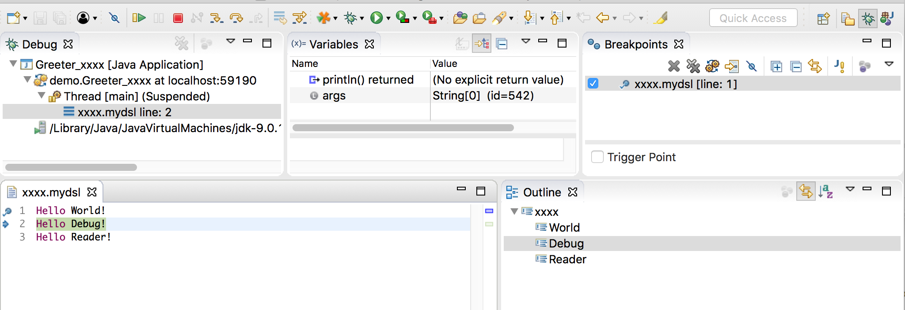

# Debugging DSLs in Xtext and Eclipse

If you build your Xtext DSL using Xbase for your expressions and implementing a `JvmModelInferrer` for the Java Mapping you get Debugging in Eclipse for free. But what about if your DSL is not using Xbase but maps to Java anyway. With the Tracing Code Generator in Xtext 2.12 and its debugging extensions in Xtext 2.13 and a few lines of Gluecode you can achieve this as well.

## Setting up the Project, Grammar and Code Generator

We create a new Xtext project using the wizard and the default grammar.

```
grammar org.xtext.example.mydsl.MyDsl with org.eclipse.xtext.common.Terminals

generate myDsl "http://www.xtext.org/example/mydsl/MyDsl"

Model:
    greetings+=Greeting*;
    
Greeting:
    'Hello' name=ID '!';
```

We like to map an example model like

```
Hello World!
Hello Debug!
Hello Reader!
```

to this simple Java code

```
package demo;

public class Greeter_xxxx {
    public static void main(String[] args) {
        System.out.println("World");
        System.out.println("Debug");
        System.out.println("Reader");
    }
}
```

A traditional code generator would look like

```
class MyDslGenerator extends AbstractGenerator {

    override void doGenerate(Resource resource, IFileSystemAccess2 fsa, IGeneratorContext context) {
        for (model : resource.allContents.filter(Model).toIterable) {
            val name = resource.URI.trimFileExtension.lastSegment
            fsa.generateFile("demo/Greeter_" + name + ".java", '''
                package demo;
                
                public class Greeter_«name» {
                    public static void main(String[] args) {
                        «FOR g : model.greetings»
                            System.out.println("«g.name»");
                        «ENDFOR»
                    }
                }
            ''')
        }
    }
}
```

For debugging this is not sufficient. We have no information which element of the generated code maps back to which elements in the source model. Nor do we have information which parts of the generated code are interesting for debugging and which are not. This is where the [Tracing Code Generation](https://typefox.io/generate-traced-code-with-xtext) comes into place. It was introduced in [Xtext 2.12](https://www.eclipse.org/Xtext/releasenotes.html#/releasenotes/2017/05/25/version-2-12-0) and extended with debugging features in [Xtext 2.13 ](https://www.eclipse.org/Xtext/releasenotes.html#/releasenotes/2017/10/20/version-2-13-0).

We first add a `TracedAccessors` extension to our generator

```
    @TracedAccessors(MyDslFactory)
    static class MyDslTraceExtensions {
    }
    
    @Inject
    extension MyDslTraceExtensions
```

That gives us convenience accessors and methods like `_name` and `_name(useForDebugging)` inside our code generator which allow us to generate traced files.

```
    override void doGenerate(Resource resource, IFileSystemAccess2 fsa, IGeneratorContext context) {
        for (model : resource.allContents.filter(Model).toIterable) {
            val name = resource.URI.trimFileExtension.lastSegment
            fsa.generateTracedFile("demo/Greeter_" + name + ".java", model, '''
                package demo;
                
                public class Greeter_«name» {
                    public static void main(String[] args) {
                        «FOR g : model.greetings»
                            System.out.println("«g._name(true)»");
                        «ENDFOR»
                    }
                }
            ''')
        }
    }
```

If we now start a runtime eclipse, additionally to the java file there will be a `.Greeter_xxxx.java._trace` file with following content (visualized)

```
Regions are surrounded by [N[ ... ]N]. Regions on the left and right with the same N are associated.
----------- Greeter_xxxx.java ----------- | -- demo/xxxx.mydsl ---
[1[package demo;                          | [1[Hello [2[World]2]!
                                          | Hello [3[Debug]3]!
public class Greeter_xxxx {               | Hello [4[Reader]4]!]1]
    public static void main(String[] args) { | 
        System.out.println("[2[World]2]");      | 
        System.out.println("[3[Debug]3]");      | 
        System.out.println("[4[Reader]4]");     | 
    }                                        | 
}                                         | 
]1]                                       | 
------------------------------------------------------------------
<N>: <isDebug> <offset>-<length> <RegionJavaClass> -> <LocationJavaClass>[<offset>,<length>,<uri>]
1:   000-184 DebugTraceBasedRegion -> LocationData[0,39,demo/xxxx.mydsl] {
2: D 107-005   DebugTraceBasedRegion -> LocationData[6,5,demo/xxxx.mydsl]
3: D 138-005   DebugTraceBasedRegion -> LocationData[19,5,demo/xxxx.mydsl]
4: D 169-006   DebugTraceBasedRegion -> LocationData[32,6,demo/xxxx.mydsl]
1:           }
```

This file will be picked up by the Xtext builder infrastructure and weaved up into the class file produced by Eclipse JDT (`DebugSourceInstallingCompilationParticipant`). If we now start debugging, we can already "step into" our DSL files but be cannot set breakpoints yet. How to do that is described in the following section.

## Writing the Gluecode

There are only a few thing that need to be done. First we create our own subclass of `XtextEditor`

```
import org.eclipse.core.runtime.CoreException;
import org.eclipse.ui.IEditorInput;
import org.eclipse.xtext.ui.editor.XtextEditor;
import org.eclipse.xtext.xbase.ui.editor.XbaseEditorInputRedirector;

import com.google.inject.Inject;

public class MyDslEditor extends XtextEditor {
    
    @Inject
    private XbaseEditorInputRedirector editorInputRedirector;
    
    @Override
    protected void doSetInput(IEditorInput input) throws CoreException {
        try {
            IEditorInput inputToUse = editorInputRedirector.findOriginalSource(input);
            super.doSetInput(inputToUse);
            return;
        } catch (CoreException e) {
            // ignore
        }
        super.doSetInput(input);
    }

}
```

and bind it in `MyDslUiModule`

```
class MyDslUiModule extends AbstractMyDslUiModule {
    
    def Class<? extends XtextEditor> bindXtextEditor() {
        MyDslEditor
    }
}
```

Then we need to implement and bind an `IStratumBreakpointSupport` to tell Xtext where breakpoints are allowed.

```
package org.xtext.example.mydsl;

import org.eclipse.emf.ecore.EObject;
import org.eclipse.xtext.debug.IStratumBreakpointSupport;
import org.eclipse.xtext.nodemodel.ICompositeNode;
import org.eclipse.xtext.nodemodel.INode;
import org.eclipse.xtext.parser.IParseResult;
import org.eclipse.xtext.resource.XtextResource;
import org.eclipse.xtext.util.ITextRegionWithLineInformation;
import org.xtext.example.mydsl.myDsl.Greeting;

public class MyDslStratumBreakpointSupport implements IStratumBreakpointSupport {

    @Override
    public boolean isValidLineForBreakPoint(XtextResource resource, int line) {
        IParseResult parseResult = resource.getParseResult();
        if (parseResult == null)
            return false;
        ICompositeNode node = parseResult.getRootNode();
        return isValidLineForBreakpoint(node, line);
    }

    protected boolean isValidLineForBreakpoint(ICompositeNode node, int line) {
        for (INode n : node.getChildren()) {
            ITextRegionWithLineInformation textRegion = n.getTextRegionWithLineInformation();
            if (textRegion.getLineNumber()<= line && textRegion.getEndLineNumber() >= line) {
                EObject eObject = n.getSemanticElement();
                if (eObject instanceof Greeting) {
                    return true;
                }
                if (n instanceof ICompositeNode && isValidLineForBreakpoint((ICompositeNode) n, line)) {
                    return true;
                }
            }
            if (textRegion.getLineNumber() > line) {
                return false;
            }
        }
        return false;
    }

}
```

```
class MyDslRuntimeModule extends AbstractMyDslRuntimeModule {
    def Class<? extends IStratumBreakpointSupport> bindIStratumBreakpointSupport() {
        return MyDslStratumBreakpointSupport;
    }
}
```

Then we need to implement an `IToggleBreakpointsTargetExtension` to tell Eclipse how to toggle the breakpoint. To make it easy we subclass the existing Xbase implementation

```
package org.xtext.example.mydsl.ui;

import org.eclipse.xtext.builder.smap.StratumBreakpointAdapterFactory;
import org.eclipse.xtext.resource.XtextResource;

public class MyDslStratumBreakpointAdapterFactory extends StratumBreakpointAdapterFactory {
    
    @Override
    protected String getClassNamePattern(XtextResource state) {
        String name = "demo.Greeter_"+state.getURI().trimFileExtension().lastSegment()+"*";
        return name;
    }
    
    public Object getAdapter(Object adaptableObject, Class adapterType) {
        if (adaptableObject instanceof MyDslEditor) {
            return this;
        }
        return null;
    }

}
```

finally we do some wiring inside the `plugin.xml`

```
    <extension point="org.eclipse.core.runtime.adapters">
        <factory class="org.xtext.example.mydsl.ui.MyDslExecutableExtensionFactory:org.xtext.example.mydsl.ui.MyDslStratumBreakpointAdapterFactory"
            adaptableType="org.xtext.example.mydsl.ui.MyDslEditor">
            <adapter type="org.eclipse.debug.ui.actions.IToggleBreakpointsTarget"/>
        </factory> 
    </extension>
    <extension point="org.eclipse.ui.editorActions">
        <editorContribution targetID="org.xtext.example.mydsl.MyDsl" 
            id="org.xtext.example.mydsl.MyDsl.rulerActions">
            <action
                label="Not Used"
                class="org.xtext.example.mydsl.ui.MyDslExecutableExtensionFactory:org.eclipse.debug.ui.actions.RulerToggleBreakpointActionDelegate"
                style="push"
                actionID="RulerDoubleClick"
                id="org.xtext.example.mydsl.MyDsl.doubleClickBreakpointAction"/>
        </editorContribution>
    </extension>
    <extension point="org.eclipse.ui.popupMenus">
        <viewerContribution
            targetID="org.xtext.example.mydsl.MyDsl.RulerContext"
            id="org.xtext.example.mydsl.MyDsl.RulerPopupActions">
            <action
                label="Toggle Breakpoint"
                class="org.xtext.example.mydsl.ui.MyDslExecutableExtensionFactory:org.eclipse.debug.ui.actions.RulerToggleBreakpointActionDelegate"
                menubarPath="debug"
                id="org.xtext.example.mydsl.MyDsl.rulerContextMenu.toggleBreakpointAction">
            </action>
            <action
                label="Not used"
                class="org.xtext.example.mydsl.ui.MyDslExecutableExtensionFactory:org.eclipse.debug.ui.actions.RulerEnableDisableBreakpointActionDelegate"
                menubarPath="debug"
                id="org.xtext.example.mydsl.MyDsl.rulerContextMenu.enableDisableBreakpointAction">
            </action>
        </viewerContribution>
    </extension>
```

That's all we need to do.

## Use the Debugger

If we start a new runtime Eclipse we can now set Breakpoints and have fun debugging.



You can find the example code [here](https://github.com/itemis/xtext-debug-example-no-xbase)
