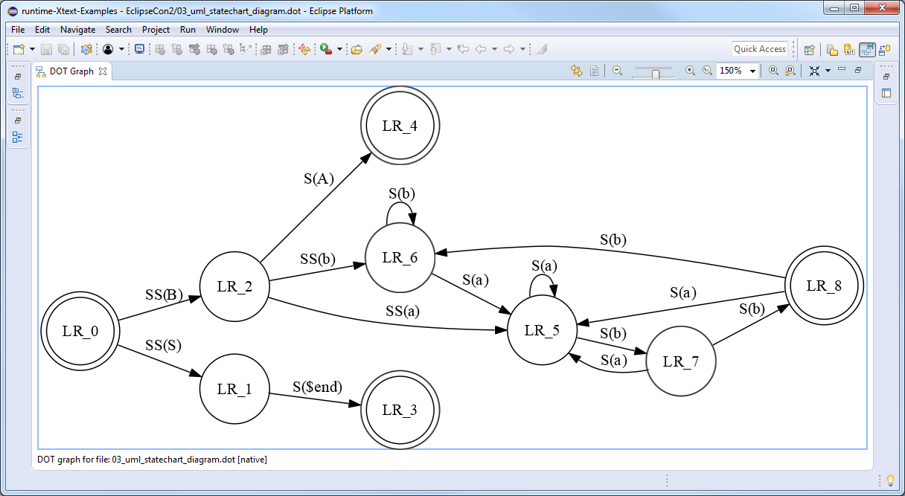
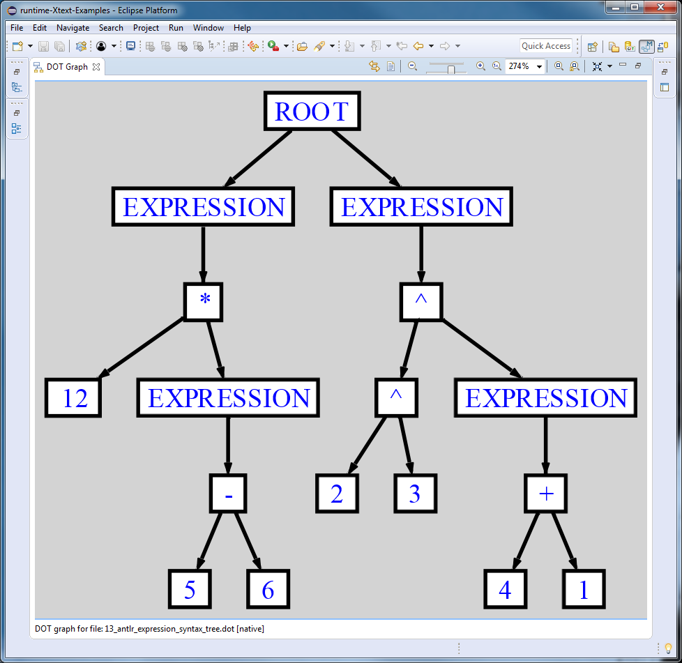
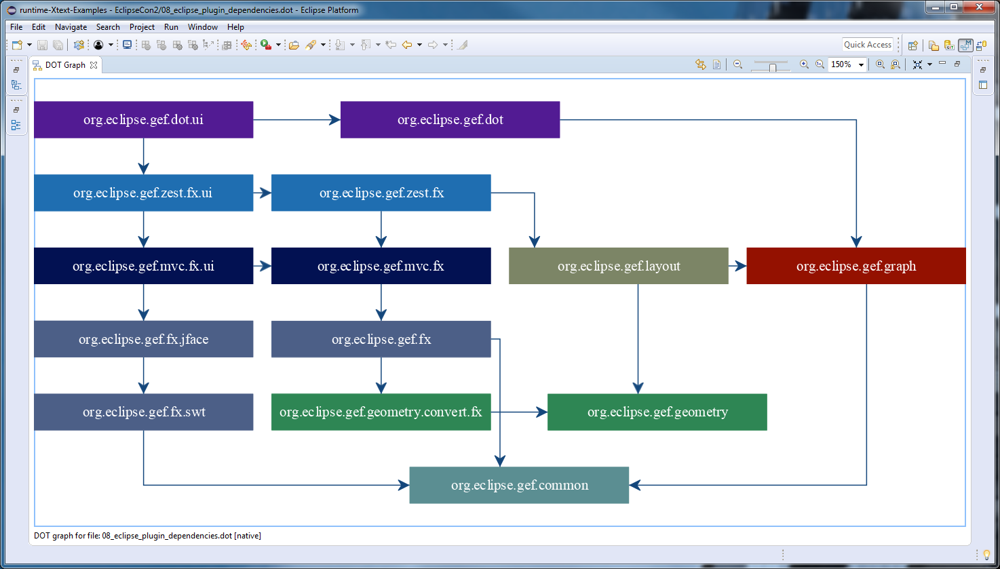
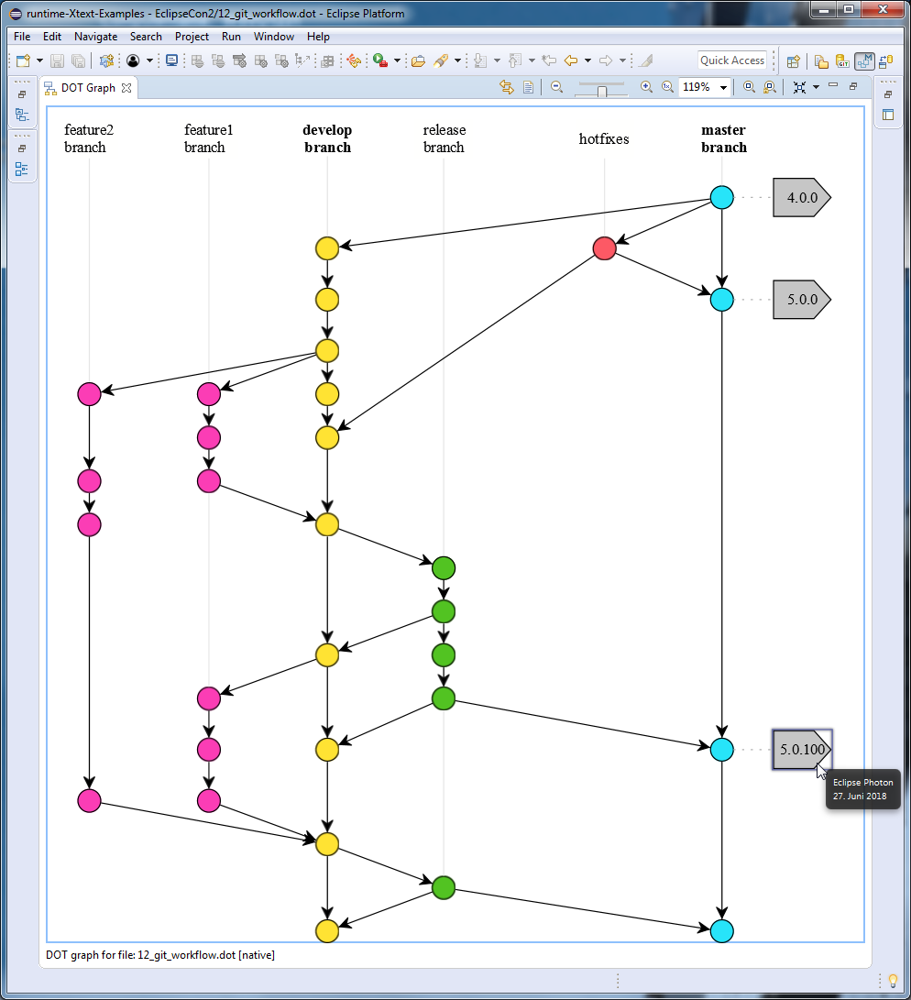

# Adding GEF DOT-based visualization support to the Eclipse IDE

The previous [blog post](https://blogs.itemis.com/en/editing-graphviz-.dot-files-with-the-gef-dot-editor) introduced the GEF DOT Editor that assists the user in editing [Graphviz](http://www.graphviz.org/) \*.dot files and the GEF DOT Graph View that is capable of visualizing them in the Eclipse Workbench UI.

This blog post continues with more complex DOT graphs to show some potential use case scenarios to add GEF DOT-based visualization support to the Eclipse IDE.

### 1. Visualization of UML Statechart Diagrams

The `finite_state_machine` DOT graph definition describes the states (DOT nodes) and the transitions (DOT edges) of a state machine. The initial and final states are visualized by `doublecircle` node shapes, all other states are represented by nodes with `circle` shape. Note the usage of the edge `label` attribute specifying the text labels on the edges. The `rankdir=LR` graph attribute requests a left-to-right graph drawing in landscape mode.
~~~dot
digraph finite_state_machine {
	rankdir=LR;
	size="8,5"
	node [shape = doublecircle]; LR_0 LR_3 LR_4 LR_8;
	node [shape = circle];
	LR_0 -> LR_2 [ label = "SS(B)" ];
	LR_0 -> LR_1 [ label = "SS(S)" ];
	LR_1 -> LR_3 [ label = "S($end)" ];
	LR_2 -> LR_6 [ label = "SS(b)" ];
	LR_2 -> LR_5 [ label = "SS(a)" ];
	LR_2 -> LR_4 [ label = "S(A)" ];
	LR_5 -> LR_7 [ label = "S(b)" ];
	LR_5 -> LR_5 [ label = "S(a)" ];
	LR_6 -> LR_6 [ label = "S(b)" ];
	LR_6 -> LR_5 [ label = "S(a)" ];
	LR_7 -> LR_8 [ label = "S(b)" ];
	LR_7 -> LR_5 [ label = "S(a)" ];
	LR_8 -> LR_6 [ label = "S(b)" ];
	LR_8 -> LR_5 [ label = "S(a)" ];
}
~~~

### 2. Visualization of ANTLR Abstract Syntax Trees
The [org.antlr.runtime.tree.DOTTreeGenerator](http://www.antlr3.org/api/Java/org/antlr/runtime/tree/DOTTreeGenerator.html) is capable of generating \*.dot files from arbitrary ANTLR abstract syntax trees. The following DOT graph definition represents the AST of the `12 * (5-6); 2^3^(4 + 1);` expressions. The DOT graph is styled using the `bgcolor`, `color`, `fillcolor`, `fontcolor` and `style` DOT attributes.

~~~dot
digraph {

	ordering=out;
	ranksep=.4;
	bgcolor="lightgrey";

	node [shape=box,
		fixedsize=false,
		fontsize=12,
		fontname="Helvetica-bold",
		fontcolor="blue"
		width=.25, height=.25,
		color="black",
		fillcolor="white",
		style="filled, solid, bold"];
	edge [arrowsize=.5, color="black", style="bold"]

	n0 [label="ROOT"];
	n1 [label="EXPRESSION"];
	n2 [label="*"];
	n3 [label="12"];
	n4 [label="EXPRESSION"];
	n5 [label="-"];
	n6 [label="5"];
	n7 [label="6"];
	n8 [label="EXPRESSION"];
	n9 [label="^"];
	n10 [label="^"];
	n11 [label="2"];
	n12 [label="3"];
	n13 [label="EXPRESSION"];
	n14 [label="+"];
	n15 [label="4"];
	n16 [label="1"];

	n0 -> n1 // "ROOT" -> "EXPRESSION"
	n1 -> n2 // "EXPRESSION" -> "*"
	n2 -> n3 // "*" -> "12"
	n2 -> n4 // "*" -> "EXPRESSION"
	n4 -> n5 // "EXPRESSION" -> "-"
	n5 -> n6 // "-" -> "5"
	n5 -> n7 // "-" -> "6"
	n0 -> n8 // "ROOT" -> "EXPRESSION"
	n8 -> n9 // "EXPRESSION" -> "^"
	n9 -> n10 // "^" -> "^"
	n10 -> n11 // "^" -> "2"
	n10 -> n12 // "^" -> "3"
	n9 -> n13 // "^" -> "EXPRESSION"
	n13 -> n14 // "EXPRESSION" -> "+"
	n14 -> n15 // "+" -> "4"
	n14 -> n16 // "+" -> "1"
}
~~~

### 3. Visualization of Eclipse Plugin Dependencies
The following DOT graph definition describes the Eclipse Plugin dependencies of the different GEF components. Note how certain nodes are grouped by anonymous subgraphs and the usage of the `group` and `rank` attributes to ensure that the nodes are properly aligned both horizontally and vertically.
~~~dot
digraph {
	node[fontcolor=white shape=box style=filled width=3]
	edge[color="#14477c" arrowhead=vee]
	splines=ortho
	
	// nodes
	{
		// GEF DOT
		rank=same
		node[color="#521B93"]
		"org.eclipse.gef.dot.ui"[group="ui"]
		"org.eclipse.gef.dot"[group="core"]
	}
	
	{
		// GEF ZEST
		rank=same
		node[color="#1F6EB1"]
		"org.eclipse.gef.zest.fx.ui"[group="ui"]
		"org.eclipse.gef.zest.fx"[group="core"]
	}
	
	{
		// GEF MVC
		rank=same
		node[color="#021152"]
		"org.eclipse.gef.mvc.fx.ui"[group="ui"]
		"org.eclipse.gef.mvc.fx"[group="core"]
	}
	
	{
		// GEF FX
		rank=same
		"org.eclipse.gef.fx"[color="#4C5F87"]
		"org.eclipse.gef.fx.jface"[color="#4C5F87"]
		"org.eclipse.gef.fx.swt"[color="#4C5F87"]
	}
	
	{
		// GEF LAYOUT
		// GEF GRAPH
		rank=same
		"org.eclipse.gef.layout"[color="#7C8566"]
		"org.eclipse.gef.graph"[color="#941100"]
	}
	
	{
		// GEF GEOMETRY
		// GEF COMMON
		rank=same
		"org.eclipse.gef.geometry.convert.fx"[color="#2E8654"]
		"org.eclipse.gef.geometry"[color="#2E8654"]
	}
	"org.eclipse.gef.common"[color="#5B8E92"]
	
	// edges
	"org.eclipse.gef.dot.ui"->"org.eclipse.gef.dot"
	"org.eclipse.gef.dot.ui"->"org.eclipse.gef.zest.fx.ui"
	"org.eclipse.gef.dot"->"org.eclipse.gef.graph"
		
	"org.eclipse.gef.fx"->"org.eclipse.gef.common"
	"org.eclipse.gef.fx"->"org.eclipse.gef.geometry.convert.fx"
	"org.eclipse.gef.fx.jface"->"org.eclipse.gef.fx.swt"
	"org.eclipse.gef.fx.swt"->"org.eclipse.gef.common"
	"org.eclipse.gef.geometry.convert.fx"->"org.eclipse.gef.geometry"
	"org.eclipse.gef.graph"->"org.eclipse.gef.common"
	"org.eclipse.gef.layout"->"org.eclipse.gef.geometry"
	"org.eclipse.gef.layout"->"org.eclipse.gef.graph"
	"org.eclipse.gef.mvc.fx"->"org.eclipse.gef.fx"
	"org.eclipse.gef.mvc.fx.ui"->"org.eclipse.gef.fx.jface"
	"org.eclipse.gef.mvc.fx.ui"->"org.eclipse.gef.mvc.fx"
	"org.eclipse.gef.zest.fx"->"org.eclipse.gef.layout"
	"org.eclipse.gef.zest.fx"->"org.eclipse.gef.mvc.fx"
	"org.eclipse.gef.zest.fx.ui"->"org.eclipse.gef.mvc.fx.ui"
	"org.eclipse.gef.zest.fx.ui"->"org.eclipse.gef.zest.fx"
}
~~~

### 4. Visualization of Git Workflows
The DOT `tooltip` attribute can specify additional information that is shown while hovering over a certain node, e.g. the description and the timestamp of a git tag in a branching/merging workflow.
~~~dot
digraph {
	
	// ...
	
	// tags
	node [shape=cds, fixedsize=false, fillcolor="#C6C6C6", penwidth=1, margin="0.11,0.055"]
	t1 [label="4.0.0" tooltip="Eclipse Neon\n22. Juni 2016"]
	t2 [label="5.0.0" tooltip="Eclipse Oxygen\n28. Juni 2017"]
	t3 [label="5.0.100" tooltip="Eclipse Photon\n27. Juni 2018"]
	
	// ...
}
~~~

All these \*.dot files (and also other ones) are hosted on the corresponding [GitHub repository](https://github.com/itemis/itemis-blog/tree/gef_adding_dot_based_visualization_support_to_the_eclipse_ide/EclipseCon2). For further information, I suggest you to take a look at the [GEF DOT User Guide](https://github.com/eclipse/gef/wiki/DOT-User-Guide) or visit the [GEF DOT session on the EclipseCon Europe 2018](https://www.eclipsecon.org/europe2018/sessions/eclipse-gef-dot-graphviz-authoring-environment-eclipse).
