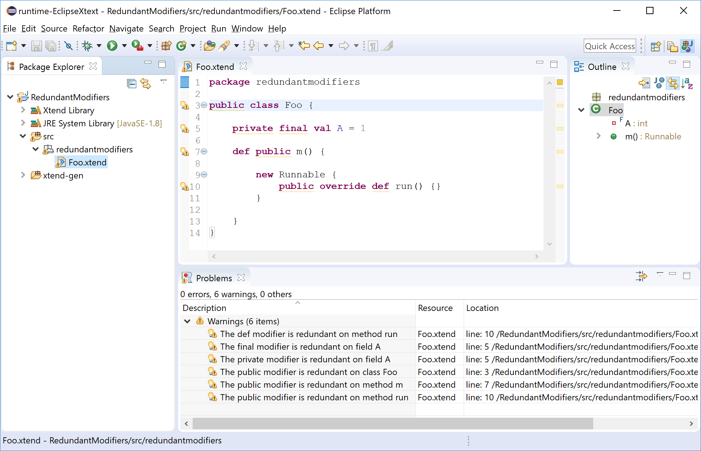
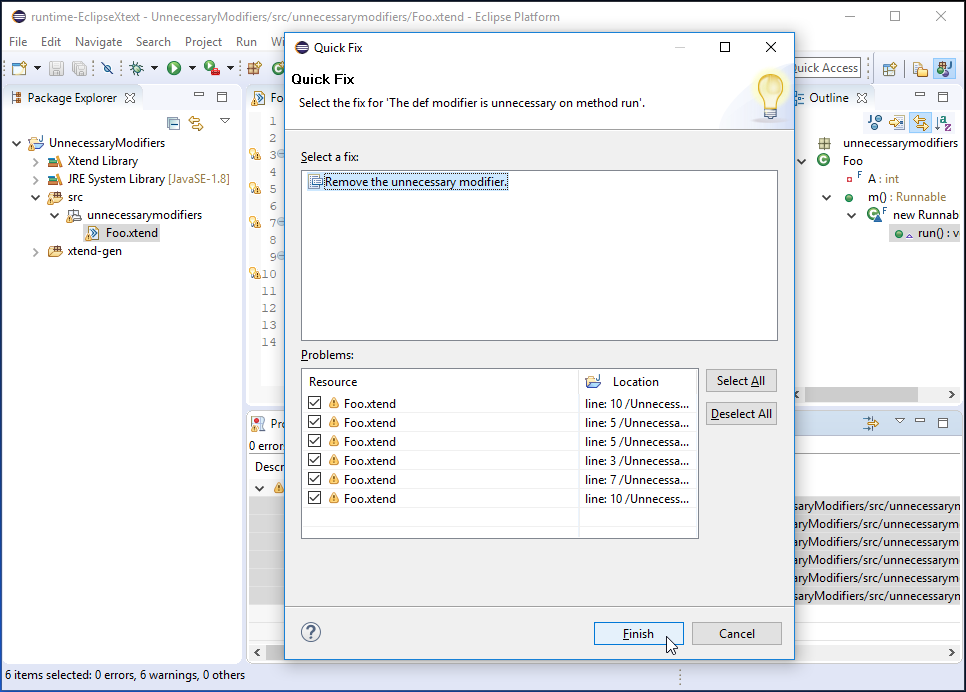
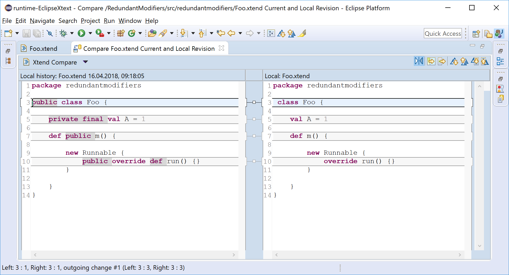
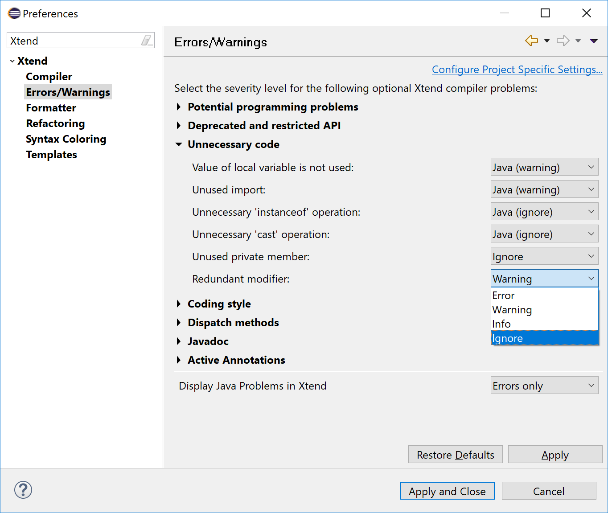

# Xtend 2.14 - Redundant modifiers validation

In the [Xtend](https://www.eclipse.org/xtend/) programming language, visibility modifier are unnecessary when they match the defaults. Visibility modifier are redundant for the following declarations:

- The `public` modifier on:
  - Classes
  - Interfaces
  - Enums
  - Annotatitons
  - Constructors
  - Methods
- The `private` modifier on:
  - Fields

Additionally the `final` modifier is considered redundant in combination with the `val` keyword on field declarations, and the `def` keyword in combination with the `override` keyword on method declarations.

Xtend 2.14 adds validation rules to detect redundant modifier and issue corresponding warnings.

The Xtend IDE also provides Quick Fixes to assist the user on fixing such issues: Select all the _Redundant modifiers_ warnings on the Problems View to invoke the Quick Fix Dialog either via the Quick Fix Context menu on the Problems View or using the keyboard shortcut `Ctrl + 1`.

After clicking on the Finish button all the _Redundant modifiers_ warnings will be fixed at the same time. Comparing the Xtend code before and after the Quick Fix execution confirms that all the redundant modifiers have been successfully removed.

For ongoing Xtend projects, it could be noisy suddenly having tons of new warnings after updating to a new Xtend version. That's why the severity of the _Redundant modifiers_ can be configured on the Xtend preference page and (wenn desired) can even be completely ignored.

The latest Xtend version can be installed from its [Update Site](http://download.eclipse.org/modeling/tmf/xtext/updates/composite/latest/). Give it a try! The Xtext team is always happy about your early feedback!
