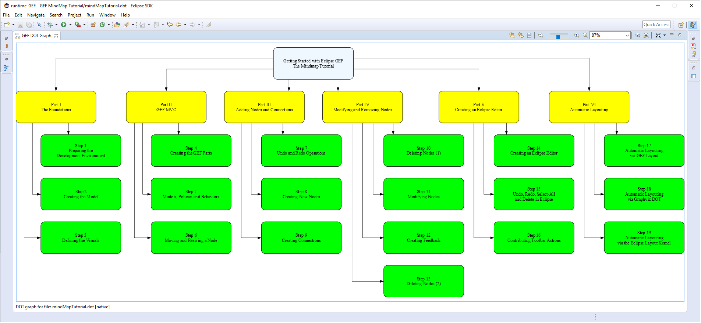

# Getting started with Eclipse GEF – the Mindmap Tutorial

The [Eclipse Graphical Editing Framework](https://www.eclipse.org/gef/) is a toolkit to create graphical Java applications either integrated in Eclipse or standalone. The most common use of the framework is to develop diagram editors, like a simple Mindmap editor we will create in the [GEF Mindmap Tutorial series](https://info.itemis.com/en/gef/tutorials/). Currently, the tutorial consists of 6 parts and all together 19 steps. They are structured as follows:

* **Part I – The Foundations**
	* Step 1: Preparing the development environment
	* Step 2: Creating the model
	* Step 3: Defining the visuals

* **Part II – GEF MVC**
	* Step 4: Creating the GEF parts
	* Step 5: Models, policies and behaviors
	* Step 6: Moving and resizing a node

* **Part III – Adding nodes and connections**
	* Step 7: Undo and redo operations
	* Step 8: Creating new nodes
	* Step 9: Creating connections

* **Part IV – Modifying and removing nodes**
	* Step 10: Deleting nodes (1)
	* Step 11: Modifying nodes
	* Step 12: Creating feedback
	* Step 13: Deleting nodes (2)

* **Part V – Creating an Eclipse editor**
	* Step 14: Creating an Eclipse editor
	* Step 15: Undo, redo, select all and delete in Eclipse
	* Step 16: Contributing toolbar actions

* **Part VI – Automatic layouting**
	* Step 17: Automatic layouting via GEF layout
	* Step 18: Automatic layouting via Graphviz DOT
	* Step 19: Automatic layouting via the Eclipse Layout Kernel

You can register for the tutorial series using the link below. The article [How to set up Eclipse tool development with OpenJDK, GEF, and OpenJFX](https://blogs.itemis.com/en/after-eight-eclipse-development-with-java-and-javafx) describes the necessary steps to properly set up your development environment.

Your feedback regarding the Mindmap Tutorial (and the Eclipse GEF project in general) is highly appreciated. If you have any questions or suggestions, please let us know via the [Eclipse GEF forum](https://www.eclipse.org/forums/index.php?t=thread&frm_id=81), or create an issue on [Eclipse Bugzilla](https://bugs.eclipse.org/bugs/describecomponents.cgi?product=GEF).

For further information, we recommend to take a look at the [Eclipse GEF blog articles](https://blogs.itemis.com/topic/gef) and watch the [Eclipse GEF session on the EclipseCon Europe 2018](https://www.youtube.com/watch?v=GnSVLNYfGlk).
