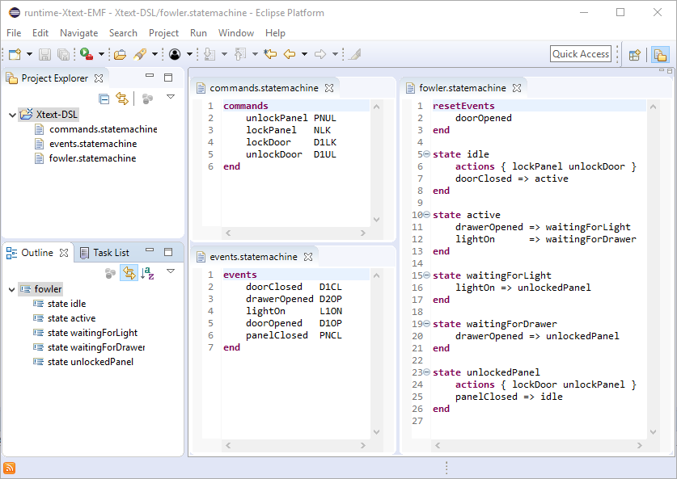
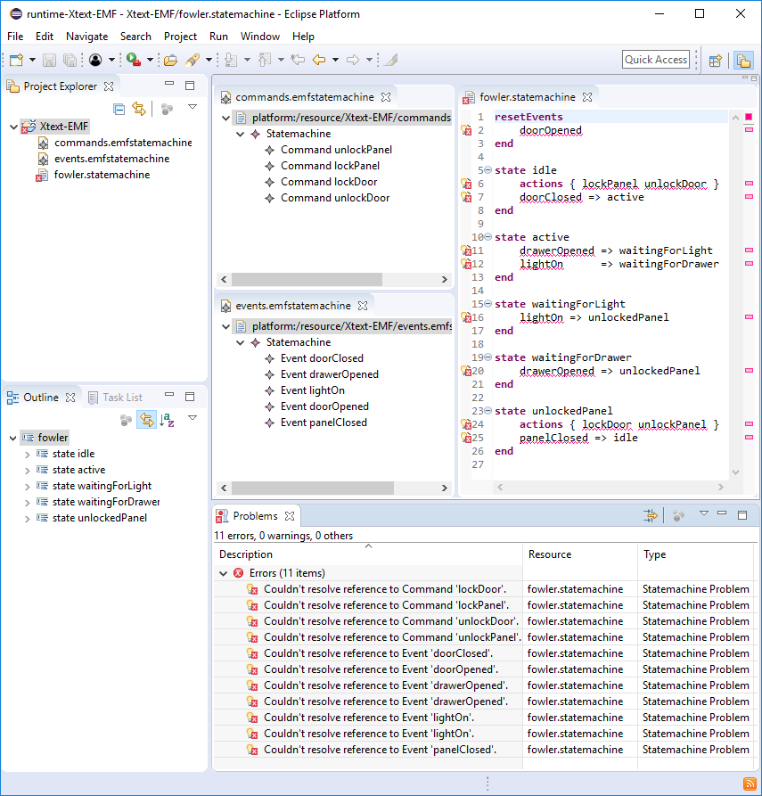
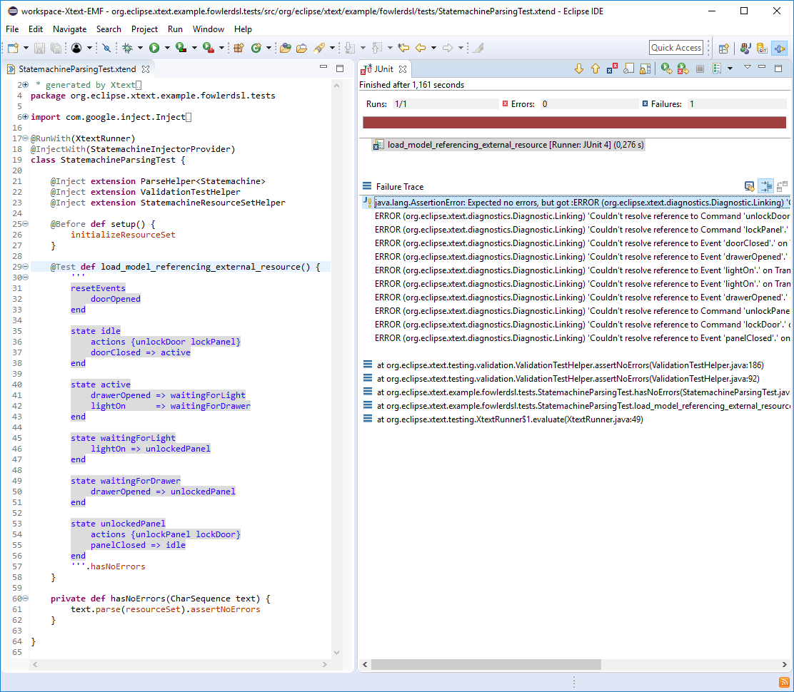
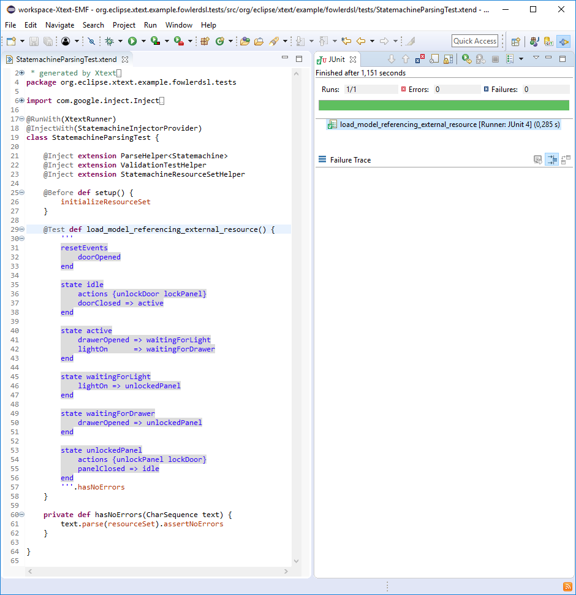
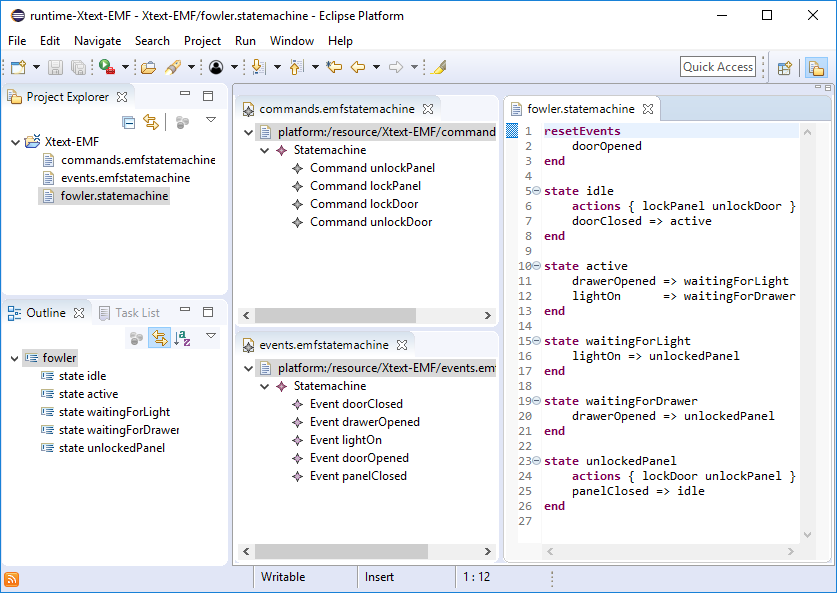

# Combining EMF Models with Xtext DSLs

This blog post demonstrates use cases on combining EMF Models with Xtext DSLs. It is based on the [Martin Fowler's secret compartment state machine implementation](https://github.com/eclipse/xtext-eclipse/blob/master/org.eclipse.xtext.xtext.ui.examples/projects/fowlerdsl/org.eclipse.xtext.example.fowlerdsl/src/org/eclipse/xtext/example/fowlerdsl/Statemachine.xtext) available via the Xtext Example Wizard.

The meta-model of the statemachine language describes that a state machine consists of certain commands, events, states and transitions.

All these elements can be defined either in one dsl file, or can be split up in several \*.statemachine files.

However, if we describe the commands and events in EMF models, the states and transitions in an Xtext DSL, the validation reports problems on the `fowler.statemachine` file that the referenced commands and events cannot be resolved.

We would like to be able to reference EMF models from the Xtext DSL. Before starting adapting the productive code base, we capture our requirement in a [StatemachineParsingTest](https://github.com/itemis/itemis-blog/blob/combining-emf-models-with-xtext-dsls/org.eclipse.xtext.example.fowlerdsl.tests/src/org/eclipse/xtext/example/fowlerdsl/tests/StatemachineParsingTest.xtend) test case.

Since we have a failing test now, we are allowed to extend the implementation. In order to be able to reference EMF models from an Xtext DSL, a new Xtext language has to be defined for the EMF resources. Thus, we define the `org.eclipse.xtext.example.fowlerdsl.emfstatemachine` Xtext language for the `*.emfstatemachine` resources using the following steps:

1. For the new language, we define the runtime dependency injection container by adding the [EmfStatmachineRuntimeModule](https://github.com/itemis/itemis-blog/blob/combining-emf-models-with-xtext-dsls/org.eclipse.xtext.example.fowlerdsl/src/org/eclipse/xtext/example/fowlerdsl/EmfStatemachineRuntimeModule.xtend) class extending the AbstractGenericResourceRuntimeModule class. The AbstractGenericResourceRuntimeModule contains the default bindings for EMF resources, the EmfStatemachineRuntimeModule defines the language specific configurations such as the language name and the file extension.

2. For the Eclipse-based UI services, we define the UI dependency injection container by adding the [EmfStatemachineUiModule](https://github.com/itemis/itemis-blog/blob/combining-emf-models-with-xtext-dsls/org.eclipse.xtext.example.fowlerdsl.ui/src/org/eclipse/xtext/example/fowlerdsl/ui/EmfStatemachineUiModule.xtend) class extending the EmfUiModule class.

3. We implement the [FowlerDslActivatorEx](https://github.com/itemis/itemis-blog/blob/combining-emf-models-with-xtext-dsls/org.eclipse.xtext.example.fowlerdsl.ui/src/org/eclipse/xtext/example/fowlerdsl/ui/internal/FowlerdslActivatorEx.xtend) class inheriting from the  generated FowlerDslActivator class and register it in the [MANIFEST.MF](https://github.com/itemis/itemis-blog/blob/combining-emf-models-with-xtext-dsls/org.eclipse.xtext.example.fowlerdsl.ui/META-INF/MANIFEST.MF#L29) file to ensure that the EmfStatemachineRuntimeModule and EmfStatemachineUiModule classes are used while creating the injector of the newly defined Xtext language.

4. In order to register the Xtext UI language services to the Xtext's registry, we implement the [EmfStatemachineExecutableExtensionFactory](https://github.com/itemis/itemis-blog/blob/combining-emf-models-with-xtext-dsls/org.eclipse.xtext.example.fowlerdsl.ui/src/org/eclipse/xtext/example/fowlerdsl/ui/EmfStatemachineExecutableExtensionFactory.xtend) that extends the
AbstractGuiceAwareExecutableExtensionFactory that delivers the bundle
and the injector of the newly created Xtext language via the FowlerDslActivatorEx class. Additionally, we register the language in the [plugin.xml](https://github.com/itemis/itemis-blog/blob/combining-emf-models-with-xtext-dsls/org.eclipse.xtext.example.fowlerdsl.ui/plugin.xml#L426-L433) via the
`org.eclipse.xtext.extension_resourceServiceProvider` extension point with the uriExtension `emfstatemachine` and an instance of the EmfResourceUIServiceProvider created via the EmfStatemachineExecutableExtensionFactory class.

5. Optionally, we can register the [EmfStatemachineReflectiveTreeEditorOpener](https://github.com/itemis/itemis-blog/blob/combining-emf-models-with-xtext-dsls/org.eclipse.xtext.example.fowlerdsl.ui/src/org/eclipse/xtext/example/fowlerdsl/ui/editor/EmfStatemachineReflectiveTreeEditorOpener.xtend) in the [EmfStatemachineUiModule](https://github.com/itemis/itemis-blog/blob/combining-emf-models-with-xtext-dsls/org.eclipse.xtext.example.fowlerdsl.ui/src/org/eclipse/xtext/example/fowlerdsl/ui/EmfStatemachineUiModule.xtend#L19-L25) to open the EMF Reflective Tree Editor when the user follows a reference from the Xtext editor
to an EMF element. To be able to use the EMF Reflective Tree Editor, we have to add the `org.eclipse.emf.ecore.editor` plugin to the `Require-Bundle` section in the [MANIFEST.MF](https://github.com/itemis/itemis-blog/blob/combining-emf-models-with-xtext-dsls/org.eclipse.xtext.example.fowlerdsl.ui/META-INF/MANIFEST.MF#L23) file.

After implementing these steps, the successful execution of StatemacineParsingTest test case confirms that the EMF model references from the Xtext DSL can be resolved.

When starting the Eclipse Runtime again, the previously reported validation errors are also gone. Note that not only the validation, but also the content assistant and the quickfix provider are aware of the existing EMF model elements.

To protect the implemented EMF-Xtext integration against regressions, it is strongly recommended to extend the test base by [Indexing](https://github.com/itemis/itemis-blog/blob/combining-emf-models-with-xtext-dsls/org.eclipse.xtext.example.fowlerdsl.tests/src/org/eclipse/xtext/example/fowlerdsl/tests/StatemachineIndexTest.xtend),
[Linking](https://github.com/itemis/itemis-blog/blob/combining-emf-models-with-xtext-dsls/org.eclipse.xtext.example.fowlerdsl.tests/src/org/eclipse/xtext/example/fowlerdsl/tests/StatemachineLinkingTest.xtend),
[Scoping](https://github.com/itemis/itemis-blog/blob/combining-emf-models-with-xtext-dsls/org.eclipse.xtext.example.fowlerdsl.tests/src/org/eclipse/xtext/example/fowlerdsl/tests/StatemachineScopeProviderTest.xtend), [ContentAssist](https://github.com/itemis/itemis-blog/blob/combining-emf-models-with-xtext-dsls/org.eclipse.xtext.example.fowlerdsl.ui.tests/src/org/eclipse/xtext/example/fowlerdsl/ui/tests/StatemachineContentAssist2Test.xtend) and [Quickfix](https://github.com/itemis/itemis-blog/blob/combining-emf-models-with-xtext-dsls/org.eclipse.xtext.example.fowlerdsl.ui.tests/src/org/eclipse/xtext/example/fowlerdsl/ui/tests/StatemachineQuickfix2Test.xtend) test cases.

An additional feature could be to add Xtext serialization support to EMF models: when the user edits an EMF element and saves the \*.emfstatemachine file, we want that the corresponding \*.statemachine Xtext DSL file is automatically generated. To achieve that, we implement the [EmfStatemachineSerializer](https://github.com/itemis/itemis-blog/blob/combining-emf-models-with-xtext-dsls/org.eclipse.xtext.example.fowlerdsl/src/org/eclipse/xtext/example/fowlerdsl/generator/EmfStatemachineSerializer.xtend) class and bind it in the [EmfStatemachineRuntimeModule](https://github.com/itemis/itemis-blog/blob/combining-emf-models-with-xtext-dsls/org.eclipse.xtext.example.fowlerdsl/src/org/eclipse/xtext/example/fowlerdsl/EmfStatemachineRuntimeModule.xtend#L20-L22) class. Furthermore, the [EmfStatemachineSerializationHandler](https://github.com/itemis/itemis-blog/blob/combining-emf-models-with-xtext-dsls/org.eclipse.xtext.example.fowlerdsl.ui/src/org/eclipse/xtext/example/fowlerdsl/ui/handlers/EmfStatemachineSerializationHandler.xtend) class registered in the [plugin.xml](https://github.com/itemis/itemis-blog/blob/combining-emf-models-with-xtext-dsls/org.eclipse.xtext.example.fowlerdsl.ui/plugin.xml#L452-L522) triggers the manual conversion from EMF to Xtext via the `Serialize EMF State-Machine with Xtext` context menu of the Package/Project Explorer.

If you would like to learn more about the Xtext-EMF integration, I recommend you  [Karsten](https://blogs.itemis.com/author/karsten-thoms) and [Holger](https://blogs.itemis.com/author/holger-schill) presentation on [How to build Code Generators for Non-Xtext Models with Xtend](https://www.youtube.com/watch?v=teOULtQ81-U).