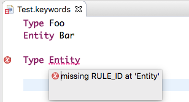
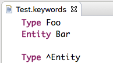
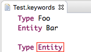
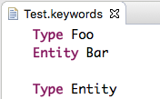

# Xtext Hint: Identifiers conflicting with keywords

By default it is not possible to use identifiers for naming elements with a name that collides with a DSLs keyword. In regular programming languages this is also not possible, for example it is not allowed in Java to name a variable, field or other element `class`, since it is a reserved verb.


In general it is recommended to avoid such situations by designing a DSL in a way that it is clear where a keyword is used and that is unlikely to come to such conflicts. One way to minimize the chance for conflicts is to have a DSL which only uses few keywords. The more verbose a DSL is and the more keywords are used, the higher the chance for conflicts is.

To circumvent this issue, Xtext allows to resolve such name collisions by prefixing an identifier with the caret character `^`. However, this looks often disturbing in a DSL model, and we have seen several DSLs where it is desired to use identifiers which are named like keywords in the DSL.

This article shows a pattern that allows to use keywords as identifiers. The source code for the article is available in our [GitHub repository](https://github.com/itemis/itemis-blog/tree/keyword_identifiers).

## Example DSL

As an example we create a small DSL that allows to define Datatypes and Entities:

```
grammar org.xtext.example.Keywords with org.eclipse.xtext.common.Terminals

generate keywords "http://www.xtext.org/example/Keywords"

Model:
	types+=Type*;

Type: DataType | Entity;

DataType:
	'Type' name=ID
;	

Entity:
	'Entity' name=ID
;
```

The DSL defines the keywords `Type` and `Entity`, which are followed by the type\`s name in the DSL code. This allows to define types with any name, but a type named `Entity` leads to an error:



The conflict is resolved by prefixing the name with `^`:



But that is not what we want, it is required that the previous DSL code is valid. Now let's see how we can achieve this.

## Grammar Modification

The main trick to achieve this is not to use the terminal rule `ID` for the `name` attributes directly. Instead, we define a datatype rule `ValidID` which allows to use an `ID` or any keyword. For the list of keywords an additional datatype rule `KEYWORD` is introduced. The list could be declared directly in `ValidID` alternatively.

The modified grammar looks now like this: 

```
[...]

DataType:
	'Type' name=ValidID
;	

Entity:
	'Entity' name=ValidID
;

ValidID: ID | KEYWORD;

KEYWORD: 'Type'|'Entity';
```

After regenerating the DSLs implementation, the desired text becomes valid code. 



But we still have one problem left: The identifier is now highlighted like a keyword.

## Syntax Coloring

The identifier `Entity` is highlighted like a keyword by the Lexical Highlighting. To correct the highlighting in these situations we have to customize the Semantic Hightlighting for the DSL.

To do so, we create a class `KeywordsSemanticHighlightingCalculator.xtend` which subclasses the default implementation `DefaultSemanticHighlightingCalculator`. The class is placed in the DSL\`s `.ide` project, since the highlighting computation is independend of the concrete UI integration. In this class the method `highlightElement` is overloaded and assigns the `DEFAULT_ID` style to the `name` feature:

```
class KeywordsSemanticHighlightingCalculator extends DefaultSemanticHighlightingCalculator {
	@Inject package KeywordsGrammarAccess grammar

	override protected boolean highlightElement(EObject object, IHighlightedPositionAcceptor acceptor,
		CancelIndicator cancelIndicator) {
		switch (object) {
			Type: {
				highlightFeature(acceptor, object, KeywordsPackage.eINSTANCE.type_Name, HighlightingStyles.DEFAULT_ID)
				return true
			}
			default: false
		}
	}
}
```

The new class has to be registered in the DSL\`s UI module:

```
class KeywordsUiModule extends AbstractKeywordsUiModule {
	def Class<? extends ISemanticHighlightingCalculator> bindISemanticHighlightingCalculator () {
		KeywordsSemanticHighlightingCalculator
	}
}
```

With this modification the DSL code now looks as it should:



## Conclusion

A DSL should be designed to avoid conflicts of identifiers with keywords, but sometimes is required to allow it. This requires to use a datatype rule instead of using directly the `ID` terminal rule. Further a customization to the semantic hightlighting is required.
