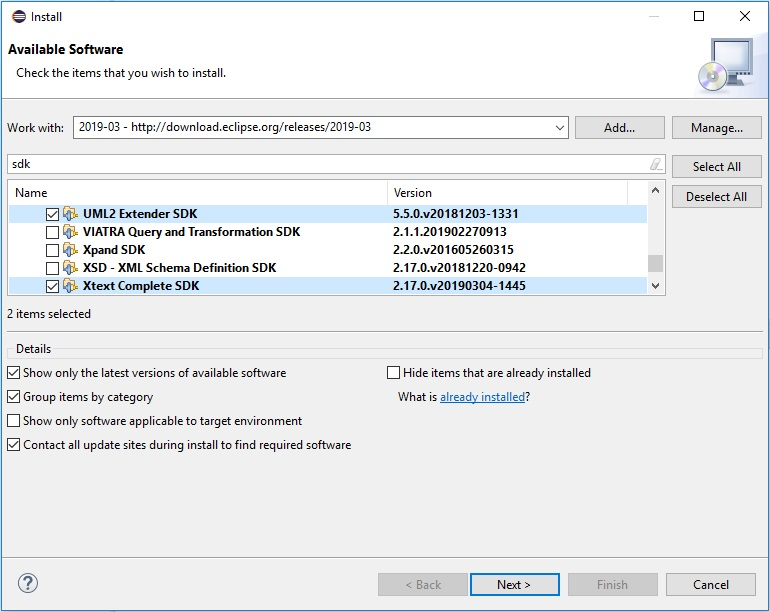
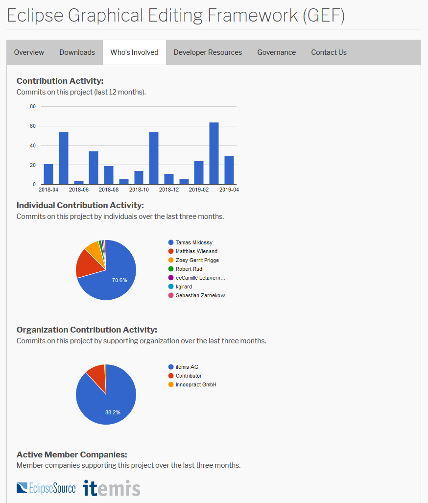

# Eclipse Graphical Editing Framework 5.1.0 Release

The Eclipse GEF team is happy to announce that the version 5.1.0 of the [Eclipse Graphical Editing Framework](https://www.eclipse.org/gef/) is part of the **Eclipse 2019-06 simultaneous release**:

The project team has worked hard since the [Eclipse GEF 5.0.0 release](https://blogs.itemis.com/en/graphical-editing-framework-gef-5.0.0-release) two years ago. The new release fixes [issues](https://projects.eclipse.org/projects/tools.gef/releases/5.1.0-2019-06/bugs) on the `GEF MVC`, `GEF Zest` and `GEF DOT` components.

We would like to thank all the contributors that make this release possible:

Your feedback about the new release is highly appreciated. If you have any questions or suggestions, please let us know via the [Eclipse GEF forum](https://www.eclipse.org/forums/index.php?t=thread&frm_id=81) or create an issue on [Eclipse Bugzilla](https://bugs.eclipse.org/bugs/describecomponents.cgi?product=GEF).

For further information, we recommend you to take a look at the [Eclipse GEF blog articles](https://blogs.itemis.com/topic/gef), watch the [Eclipse GEF session on the EclipseCon Europe 2018](https://www.youtube.com/watch?v=GnSVLNYfGlk) and try out the [Getting started with Eclipse GEF online tutorial](https://info.itemis.com/en/gef/tutorials/). 
