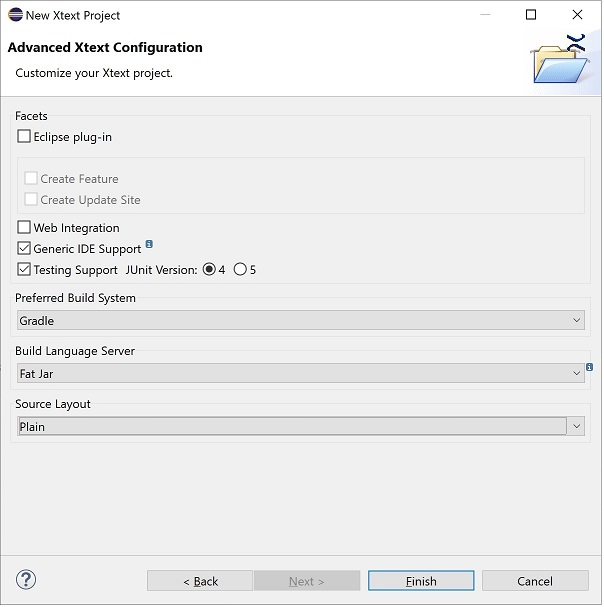

# Xtext and the Language Server Protocol

Demonstrator to create an [LSP](https://microsoft.github.io/language-server-protocol/) Language Server with [Xtext](https://www.eclipse.org/Xtext/) to the [Domainmodel language](https://www.eclipse.org/Xtext/documentation/102_domainmodelwalkthrough.html).

**Step1:** Create a new Xtext Project with Language Server Support

**Step2:** Implement the Domainmodel Laguage following the [Xtext - 15 Minutes Tutorial](https://www.eclipse.org/Xtext/documentation/102_domainmodelwalkthrough.html).

**Step3:** Create the Domainmodel Language Server using Gradle:

Execute the `gradlew shadowJar` command from the `org.example.domainmodel.parent` project. This gradle task creates the fat jar under `org.example.domainmodel.parent\org.example.domainmodel.ide\build\libs\org.example.domainmodel.ide-1.0.0-SNAPSHOT-ls.jar`.

**Step4:** Start the Domainmodel Language Server:

The `java -jar org.example.domainmodel.ide-1.0.0-SNAPSHOT-ls.jar log debug` command starts the Language Server via the main method of the [org.eclipse.xtext.ide.server.ServerLauncher](https://github.com/eclipse/xtext-core/blob/052a77310407cf8d4ca06298232625a10550076f/org.eclipse.xtext.ide/src/org/eclipse/xtext/ide/server/ServerLauncher.java#L41-L43) class (as specified in the [org.example.domainmodel.ide\build.gradle](https://github.com/itemis/itemis-blog/blob/b3e4e0dbc9499059449da441b766187d07e9d37e/org.example.domainmodel.parent/org.example.domainmodel.ide/build.gradle#L13) file). It also creates a log file that confirms that the Xtext Language Server has been started.