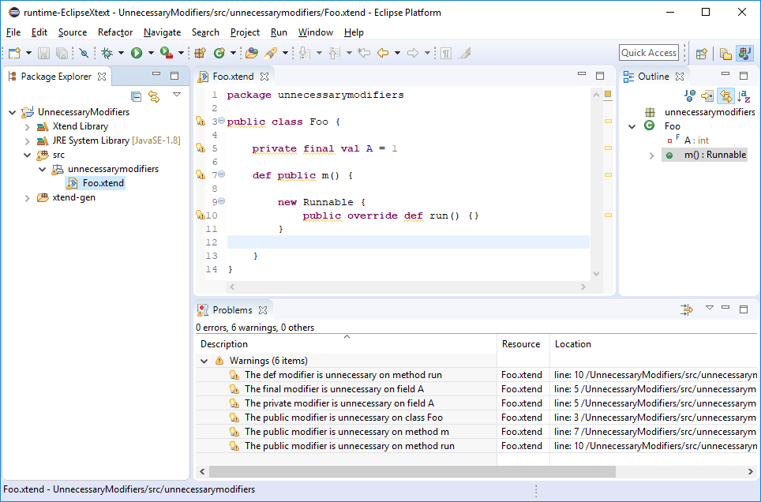

# Xtend 2.14 - Unnecessary modifiers validation

In the [Xtend](https://www.eclipse.org/xtend/) programming language, visibility modifiers are unnecessary when they match the defaults.

- The `public` modifier is default on:
  - Classes
  - Interfaces
  - Enums
  - Annotatitons
  - Constructors
  - Methods
- The `private` modifier is default on:
  - Fields

Additionally the `final` modifier is redundant in combination with the `val` keyword on field declarations, and the `def` keyword in combination with the `override` keyword on method declarations.

Xtend 2.14 adds validation rules to detect the unnecessary modifiers and issues corresponding warnings.

The Xtend IDE also provides Quick Fixes to assist the user on fixing such issues: Select all _Unnecessary modifier_ warnings on the Problems view and invoke the Quick Fix dialog either via the context menu or the keyboard shortcut `Ctrl + 1`.

After clicking on the Finish button all _Unnecessary modifier_ warnings will be fixed at once with a single action. Comparing the Xtend code before and after the Quick Fix execution confirms that all unnecessary modifiers have been successfully removed.

For ongoing Xtend projects, it could be noisy suddenly having tons of new warnings after updating to a new Xtend version. The _Unnecessary modifier_ serverity can be configured on the Xtend preference page and (wenn desired) can even be completely ignored.

The latest Xtend version can be installed from its [Update Site](http://download.eclipse.org/modeling/tmf/xtext/updates/composite/latest/). Give it a try! The Xtext team is always happy about your early feedback!
