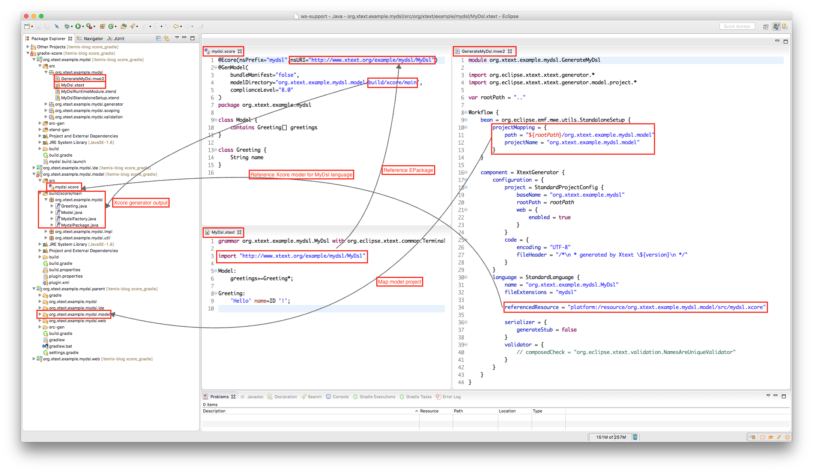

# Using Xtext with Xcore and Gradle

Xtext derives a metamodel from the grammar file by default. For more complex languages it is often better to manually define the metamodel since it allows much more control over the AST. The metamodel has to be an EMF metamodel, which could be defined in Ecore or in Xcore. 

The Xcore SDK allows to define the metamodel in a DSL which has some advantages against the definition in Ecore. However, using Xcore adds some complexity to the toolchain. Some of these implications are adressed by Holger Schill's presentation ["Using Xcore models with Xtext"](http://de.slideshare.net/holgerschill/using-xcore-with-xtext). The presentation also covers the build integration aspect, but with Maven and with the "old" Xtext generator workflows.

Nowadays often Gradle is chosen as the build system to use. The new Xtext project wizard introduced with Xtext 2.9 allows to choose Gradle as the build system and produces the necessary build files for the projects. When using Xtext's Web integration it is even mandatory at this time to use Gradle.

The problem now is that when an Xcore metamodel should be used, there is not much known on how to integrate Xcore in a Gradle build. At GitHub there is a [xcore-gradle-example](https://github.com/ghillairet/xcore-gradle-example), but this only works with Gradle 2.7 and not with the current version 3.1. Further, it uses the old Xtext gradle plugin, and not the new [Xtext Builder Plugin](http://xtext.github.io/xtext-gradle-plugin/xtext-builder.html).

This article shows an example which uses the following technology stack:

* Xtext 2.10
* Gradle 3.1
* Xcore 1.3.1

All sources are available in our [GitHub repository](https://github.com/itemis/itemis-blog/tree/xcore_gradle).

## Project Creation

As a reference the default "Greeting DSL" is used which is produced by the Xtext project wizard. The following options where chosen on the *Advanced Xtext Configuration* page:

* Web Integration
* Generic IDE Support
* Preferred Build System: Gradle

This creates the following projects:

```
org.eclipse.example.mydsl.parent
|
+--org.eclipse.example.mydsl
|
+--org.eclipse.example.mydsl.ide
|
+--org.eclipse.example.mydsl.web
```


For the parent project the latest gradle wrapper was added:

```
gradle wrapper --gradle-version 3.1
```

## Model Project

The Xcore model should be defined in a separate subproject `org.eclipse.example.mydsl.model`. The new project is added as a subproject to the `settings.gradle` of the parent project:

```
include 'org.xtext.example.mydsl.model'
include 'org.xtext.example.mydsl'
...
```

It contains the Xcore model [`mydsl.xcore`](https://github.com/itemis/itemis-blog/blob/xcore_gradle/org.xtext.example.mydsl.parent/org.xtext.example.mydsl.model/src/mydsl.xcore) in the folder `src`. The declared metamodel is equivalent to the one that Xtext would generate from the grammar definition:

```
@Ecore(nsPrefix="mydsl",nsURI="http://www.xtext.org/example/mydsl/MyDsl")
@GenModel(
    bundleManifest="false",
    modelDirectory="org.xtext.example.mydsl.model/build/xcore/main", 
    complianceLevel="8.0"
)
package org.xtext.example.mydsl

class Model {
	contains Greeting[] greetings
}

class Greeting {
	String name
}
```

Note that the model directory is `org.xtext.example.mydsl.model/build/xcore/main`. This directory is added as a source folder to the project.

To build the project with Gradle the following [`build.gradle`](https://github.com/itemis/itemis-blog/blob/xcore_gradle/org.xtext.example.mydsl.parent/org.xtext.example.mydsl.model/build.gradle) is used:

```
dependencies {
	compile "org.eclipse.xtext:org.eclipse.xtext:${xtextVersion}"
	compile "org.eclipse.xtext:org.eclipse.xtext.xbase:${xtextVersion}"
	compile 'org.eclipse.emf:org.eclipse.emf.ecore.xcore.lib:+'
	
	xtextLanguages 'org.eclipse.emf:org.eclipse.emf.ecore.xcore:+'
	xtextLanguages 'org.eclipse.emf:org.eclipse.emf.ecore.xcore.lib:+'
	xtextLanguages 'org.eclipse.emf:org.eclipse.emf.codegen.ecore:+'
	xtextLanguages 'org.eclipse.emf:org.eclipse.emf.codegen.ecore.xtext:+'
	xtextLanguages "org.eclipse.xtext:org.eclipse.xtext.ecore:${xtextVersion}"

}

sourceSets {
	main {
		resources {
			exclude '**/*.xcore'
		}
	}
}

xtext {
	version = "${xtextVersion}"
	languages {
		ecore {
			setup = 'org.eclipse.xtext.ecore.EcoreSupport'
		}
		codegen {
			setup = 'org.eclipse.emf.codegen.ecore.xtext.GenModelSupport'
		}
		xcore {
			setup = 'org.eclipse.emf.ecore.xcore.XcoreStandaloneSetup'
			generator.outlet.producesJava = true
		}
	}
}
```

The main part is the configuration of the [`xtext-builder-plugin`](http://xtext.github.io/xtext-gradle-plugin/xtext-builder.html). `EcoreSupport` and `GenModelSupport` have to be added as languages, since they are used by Xcore. For Xcore the `producesJava` flag has to be set, so that the produced Java classes are compiled and packaged in the resulting jar file.

## Runtime Project

In the DSL runtime project we have to make some changes in order to use the metamodel defined with Xcore.

### build.gradle

First, a build dependency has to be added to the [`build.gradle`](https://github.com/itemis/itemis-blog/blob/xcore_gradle/org.xtext.example.mydsl.parent/org.xtext.example.mydsl/build.gradle) file:

```
dependencies {
	compile project(':org.xtext.example.mydsl.model')
	...
}
```

Next, two additional dependencies have to be added to the `mwe2` configuration:

```
dependencies {
	mwe2 "org.eclipse.emf:org.eclipse.emf.mwe2.launch:2.8.3"
	mwe2 "org.eclipse.xtext:org.eclipse.xtext.xtext.generator:${xtextVersion}"
	// added for Xcore support
	mwe2 'org.eclipse.emf:org.eclipse.emf.ecore.xcore:+'
	mwe2 'org.eclipse.emf:org.eclipse.emf.codegen.ecore.xtext:+'
}
```

### DSL Grammar

Since the grammar's metamodel should not be generated anymore the grammar definition [`MyDsl.xtext`](https://github.com/itemis/itemis-blog/blob/xcore_gradle/org.xtext.example.mydsl.parent/org.xtext.example.mydsl/src/org/xtext/example/mydsl/MyDsl.xtext) has to be changed slightly. Instead of declaring the Ecore package to `generate`, we `import` it:

```
grammar org.xtext.example.mydsl.MyDsl with org.eclipse.xtext.common.Terminals

import "http://www.xtext.org/example/mydsl/MyDsl"

Model:
	greetings+=Greeting*;
	
Greeting:
	'Hello' name=ID '!';
```

### Xtext Generator Workflow

Also the generator workflow file [`GenerateMyDsl.mwe2`](https://github.com/itemis/itemis-blog/blob/xcore_gradle/org.xtext.example.mydsl.parent/org.xtext.example.mydsl/src/org/xtext/example/mydsl/GenerateMyDsl.mwe2) has to be changed to use the manually defined metamodel.

First, the model project `org.xtext.example.mydsl.model` is declared using a project mapping: 

```
bean = org.eclipse.emf.mwe.utils.StandaloneSetup {
	projectMapping = {
		path = "${rootPath}/org.xtext.example.mydsl.model"
		projectName = "org.xtext.example.mydsl.model"
	}
}
```

This is required in order to reference the `mydsl.xcore` file later with a platform resource URI. Without this registration, the platform URI cannot be mapped. The `mydsl.xcore` file is now declared as a `referencedResource` for the MyDSL language configuration:

```
language = StandardLanguage {
	name = "org.xtext.example.mydsl.MyDsl"
	fileExtensions = "mydsl"
	
	referencedResource = "platform:/resource/org.xtext.example.mydsl.model/src/mydsl.xcore"
	...
}
```

## Overview

The following image shows the resulting project structure with the files [`mydsl.xcore`](https://github.com/itemis/itemis-blog/blob/xcore_gradle/org.xtext.example.mydsl.parent/org.xtext.example.mydsl.model/src/mydsl.xcore), [`MyDsl.xtext`](https://github.com/itemis/itemis-blog/blob/xcore_gradle/org.xtext.example.mydsl.parent/org.xtext.example.mydsl/src/org/xtext/example/mydsl/MyDsl.xtext) and [`GenerateMyDsl.mwe2`](https://github.com/itemis/itemis-blog/blob/xcore_gradle/org.xtext.example.mydsl.parent/org.xtext.example.mydsl/src/org/xtext/example/mydsl/GenerateMyDsl.mwe2):



## Conclusion

Using an Xcore metamodel for an Xtext grammar requires an additional subproject which holds the Xcore definition. The article showed the necessary setup to build the model project with Gradle and integrate it into the project build.

Some additional changes have to be done to the Xtext grammar to use the predefined metamodel and to integrate it into Xtext's generator workflow.

The Gradle build configuration is a bit tricky, but taking [this project](https://github.com/itemis/itemis-blog/tree/xcore_gradle) as a reference it should be mostly copy/paste work.
