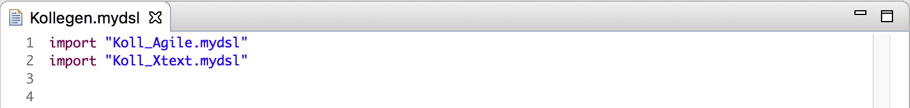
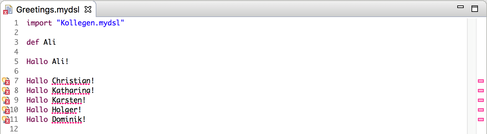

# Transitive Imports

Xtext ermöglicht das Referenzieren von Elementen in DSLs auf mehrere Arten. Eine Möglichkeit sieht den Import von Elementen über Namensräume vor. Dies geschieht über die Verwendung des `ImportedNamespaceAwareLocalScopeProvider` und erlaubt den "Import" einzelner oder, unter Einsatz von Wildcards (`.*`), aller Elemente eines Namensraumes.   
Es kann aber Sprachen geben, in denen dieses Verhalten nicht gewünscht ist. In diesen Sprachen importiert der Nutzer explizit eine oder mehrere Ressource-Dateien, um auf deren Inhalte zugreifen zu können.  

Eine DSL mit einem solchen Import-Verhalten läßt sich recht einfach erstellen, indem man eine Parser-Regel mit dem speziellen Attributnamen `importURI` in die DSL einbaut. Das folgende Beispiel stellt eine einfache DSL dar, die es erlaubt, in beliebigen Ressourcen, Namen zu definieren und diese in Grußbotschaften zu verwenden.

Wir möchten Kollegen aus unserer Firma Grußbotschaften schicken. Da die Firma aber groß ist und aus vielen Kollegen besteht, die in unterschiedlichen Bereichen arbeiten, möchten wir für jeden Firmenbereich eine eigene Datei erstellen, die die Namen der jeweiligen Kollegen enthält. Dies erhöht die Übersicht und Wartbarkeit.  
Nur durch einen expliziten Import einer Resource wollen wir die enthaltenen Namensdefinitionen in den Scope aufnehmen. Dabei soll dies möglichst schnell und resourcenschonend erfolgen.  

Der Ansatz ist hierbei die Verwendung des Index, die das unnötige und (bei großen Modellen)  zeitaufwendige Laden von Resourcen überflüssig macht. Als ersten Schritt müssen wir die Informationen bzgl. der importierten Resourcen in den Index schreiben. Dazu implementieren wir eine Klasse `MyDslResourceDescriptionStrategy`, die von `DefaultResourceDescriptionStrategy` ableitet. Die Strings mit den URIs, der in der Parser-Regel _Model_ importierten Ressourcen, werden in einen durch Kommas getrennten String zusammengeführt und unter dem Schlüssel _includes_ in der _UserData_ Map der Objektbeschreibung im Index gespeichert.  

Um unsere `ResourceDescriptionStrategy` nutzen zu können, müssen wir sie noch im `MyDslRuntimeModule` binden.

Bisher haben wir nur Informationen gesammelt und im Index gespeichert. Um sie verwenden zu können, benötigen wir zusätzlich einen eigenen `IGlobalScopeProvider`.
Dazu implementieren wir eine Klasse `MyDslGlobalScopeProvider`, die von `ImportUriGlobalScopeProvider` ableitet, und überschreiben die Methode `getImportedUris(Resource resource)`. Diese Methode liefert ein LinkedHashSet zurück, das letztendlich alle URIs enthält, die in der Resource importiert werden sollen.  
Das Auslesen der importierten Resourcen aus dem Index wird von der Methode `collectImportUris` erledigt. Die Methode fragt den `IResourceDescription.Manager` nach der `IResourceDescription` der Resource. Aus dieser wird für jedes _Model_-Element aus der _UserData_ Map der unter dem Schlüssel _includes_ gespeicherte String mit den URIs der importierten Resourcen ausgelesen, zerlegt und die einzelnen URIs in einem Set gespeichert.  

Um unseren `MyDslGlobalScopeProvider` nutzen zu können, müssen wir diesen wiederum im `MyDslRuntimeModule` binden.

Wir starten den Editor für unsere kleine Sprache und beginnen die Modell-Dateien zu erstellen. Dabei haben wir die Idee, die Resourcen der unterschiedlichen Firmenbereiche nicht einzeln zu importieren, sondern eine Resource zu erstellen, die alle Importe enthält, und diese dann zu importieren. Dazu erstellen wir folgende Resourcen:  

Beim Erstellen der Resource mit den Grußbotschaften stellen wir fest, daß die Namen nicht aufgelößt werden können.

Woran liegt das? Wir haben doch alle importierten Resourcen in den Index geschrieben.  
Das ist soweit richtig. Alle direkt importieren Resourcen werden in den Index geschrieben. Die Importe in einer importierten Resource jedoch werden ignoriert. Das von uns gewünschte Feature bezeichnet man als **transitive Importe**. Mit dem Import einer Resource werden implizit alle von ihr importierten Resourcen mit importiert.  
Um in unserer Sprache **transitive Importe** zu ermöglichen, müssen wir unseren `MyDslGlobalScopeProvider` anpassen. Statt die URI einer importierten Resource nur in dem Set zu speichern, rufen wir zusätzlich die Methode `collectImportUris` auf und übergeben die URI als Parameter, so daß deren importierte Resourcen ebenfalls verarbeitet werden.

Wenn wir nach dieser kleinen Anpassung unsere Resource mit den Grußbotschaften erneut öffnen, sehen wir, daß die Namen durch die **transitiven Importe** aufgelößt werden können.

