# Transitive Imports

Standardmäßig werden Cross-Referenzen, die in unterschiedlichen Ressourcen definiert werden, automatisch von Xtext aufgelöst. Es kann aber Sprachen geben, in denen dieses Verhalten nicht gewünscht ist. In diesen Sprachen muss der Nutzer Ressourcen, auf deren Inhalte er zugreifen möchte, explizit importieren. Dies geschieht üblicherweise über Schlüsselworte wie _include_, _import_ oder _use_.
Je nach Anforderung kann man hierbei unterscheiden zwischen expliziten und transitiven Imports. Um die Unterschiede zu verdeutlichen erstellen wir zuerst eine kleine Beispielsprache. Unsere Sprache ist angelehnt an die Xtext Default-Grammatik.

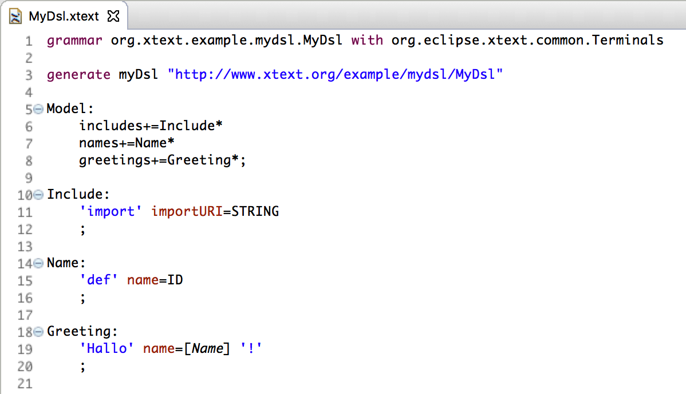

Die Sprache erlaubt es in beliebigen Ressourcen, Namen zu definieren und diese in Grußbotschaften zu verwenden. Um einen Namen referenzieren zu können, der in einer anderen Ressource  definiert ist, muss die Resource explizit importiert werden.

Die Strings mit den URIs, der in der ParserRule _Model_ importierten Ressourcen, sollen  mit der jeweiligen `EObjectDescription` als _userData_ in den Index geschrieben werden. Dazu müssen wir eine eigene `ResourceDescriptionStrategy` implementieren, die das übernimmt.

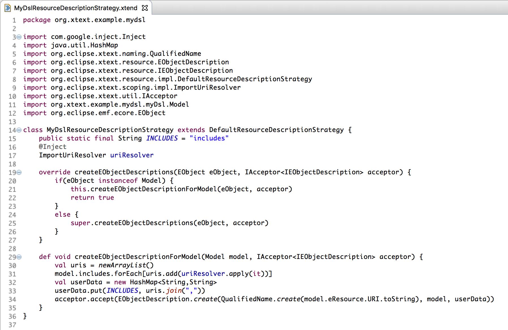

Die Klasse leitet von `DefaultResourceDescriptionStrategy` ab und behandelt die Erstellung der `EObjectDescription` für _Model_-Elemente gesondert, indem die Methode `createEObjectDescriptionForModel` aufgerufen wird. Über diese Methode werden die in der Resource importierten URIs, in einen durch Kommas getrennten String zusammengeführt und unter dem Schlüssel _includes_ in der _userData_ Map der Objektbeschreibung im Index gespeichert.

Um unsere `ResourceDescriptionStrategy` nutzen zu können, müssen wir sie noch im RuntimeModule binden.

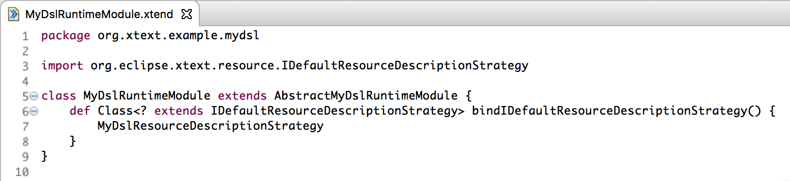

Bisher haben wir nur Informationen gesammelt und im Index gespeichert. Um sie verwenden zu können, müssen wir zusätzlich einen `IGlobalScopeProvider` implementieren.
Dazu schreiben wir eine Klasse `MyDslGlobalScopeProvider`, die von `ImportUriGlobalScopeProvider` ableitet, und überschreiben die Methode `getImportedUris(Resource resource)`. Diese Methode liefert ein LinkedHashSet zurück, das letztendlich alle URIs enthält, die in der Resource importiert werden sollen.  
Das Auslesen der importierten Resourcen aus dem Index wird von der Methode `collectImportUris` erledigt. Die Methode fragt den `IResourceDescription.Manager` nach der `IResourceDescription` der Resource. Aus dieser wird für jedes _Model_-Element aus der _userData_ Map der unter dem Schlüssel _includes_ gespeicherte String mit den URIs der importierten Resourcen ausgelesen, zerlegt und die einzelnen URIs in einem Set gespeichert.  

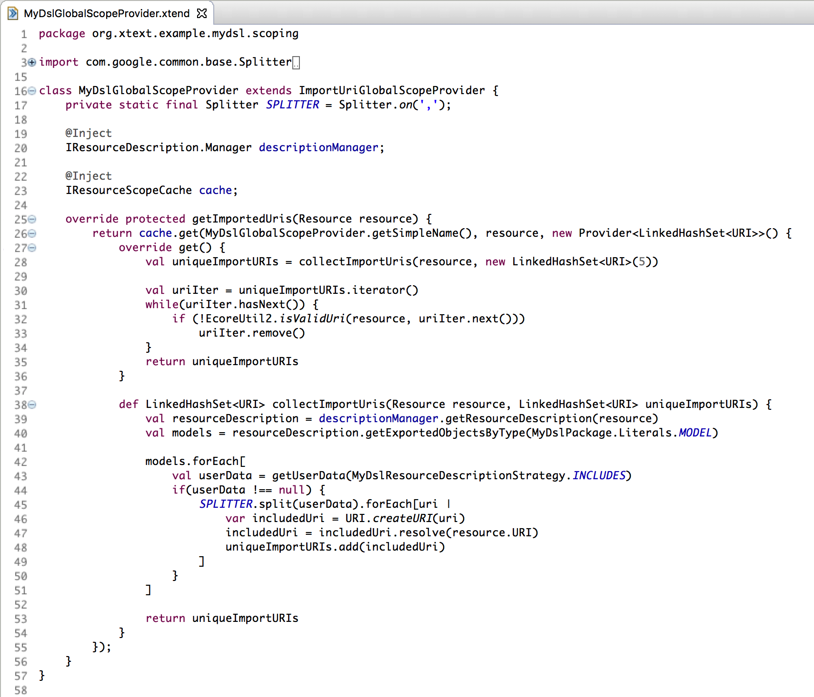

Um unseren `MyDslGlobalScopeProvider` nutzen zu können, müssen wir diesen wiederum im `RuntimeModule` binden.

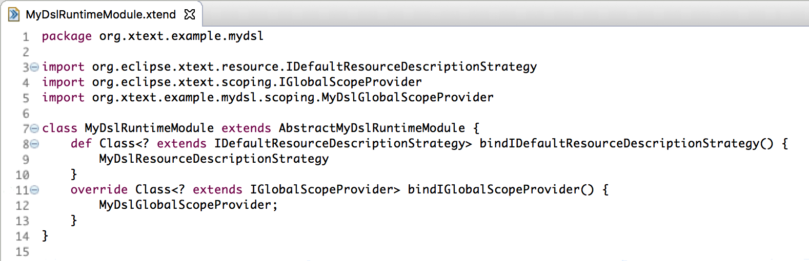

Wir starten den Editor für unsere kleine Sprache und erstellen die zwei Modell-Dateien `Kollegen.mydsl` und `Greetings.mydsl` mit Namen von Arbeitskollegen:  

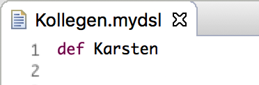

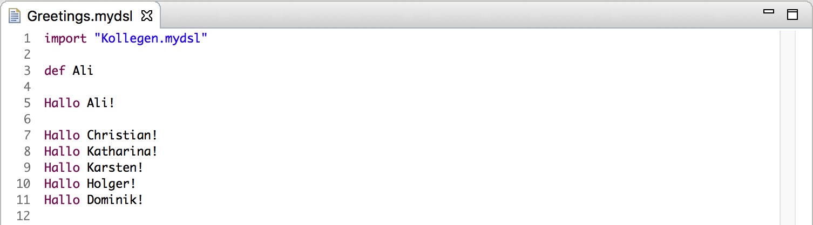

Wie wir sehen, können wir in `Greetings.mydsl`, Ali und Karsten (der in `Kollegen.mydsl` definiert ist) grüßen.  
Das ist soweit nichts Spektakuläres. Da wir aber viele Kollegen haben, die in unterschiedlichen Bereichen tätig sind, wollen wir die Namen evtl. auch in separaten Resource Dateien gruppieren, um die Übersicht zu behalten. Wir legen also für verschiedene Firmenbereiche eigene Resource Dateien mit den jeweiligen Namen an:  

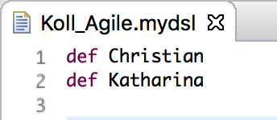  

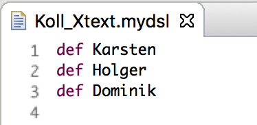  

Indem wir die zwei Resource Dateien in `Greetings.mydsl` importieren, können wir alle Namen referenzieren.  

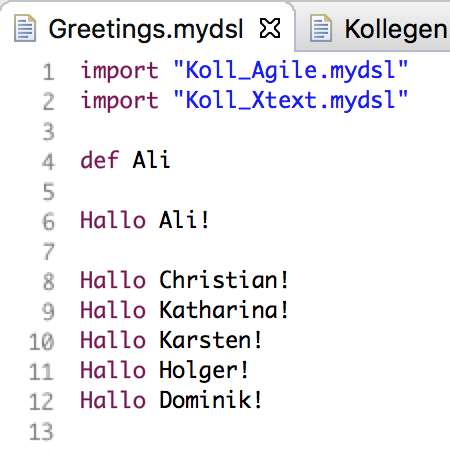  

Da die Firma aber viele Bereiche besitzt, bedeutet es, das wir viele verschiedene Resourcen importieren müssen. Es wäre schöner, wenn wir mit dem Import einer einzelnen Resource, Zugriff auf die Namen der Kollegen aller Bereiche bekämen (die sich wiederum in unterschiedlichen Resourcen befinden). Dieses Feature bezeichnet man als **transitive Importe**. Mit dem Import einer Resource werden implizit alle von ihr importierten Resourcen mit importiert.  

Um transitives Importieren zu ermöglichen, müssen wir unseren Global Scope Provider anpassen. Statt die URI einer importierten Resource nur in dem Set zu speichern rufen wir zusätzlich die Methode `collectImportUris` auf und übergeben die URI als Parameter, sodass deren importierte Resourcen ebenfalls verarbeitet werden.

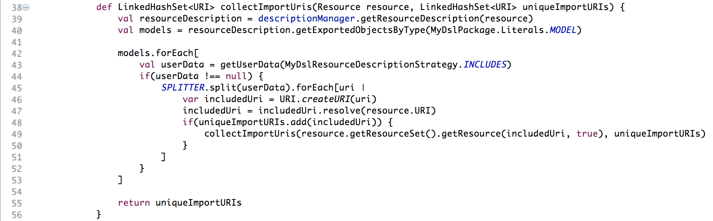

Nach dieser kleinen Änderung können wir die Dateien `Kollegen.mydsl` und `Greetings.mydsl` folgendermaßen anpassen:  

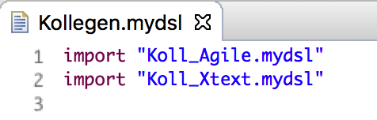  

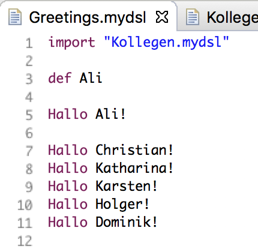  

Das hier beschriebene Vorgehen hat den großen Vorteil, dass zum Sammeln der importierten URIs nicht die jeweiligen Resourcen geladen werden müssen, sondern dass diese Informationen schnell und speicherschonend aus dem Index ausgelesen werden können.
