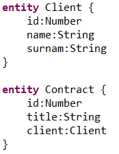
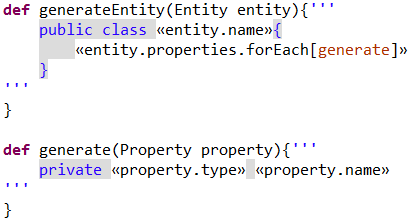

#Building Domain-specific languages with Xtext and Xtend#
Specifying the requirements of a software system and converting such a specification into executable source code is difficult and error-prone.
Requirements spefications written in prose are often ambiguous and hard to understand for developers.
Therefore, the process of turning this documents into software is slow and error-prone.
Domain-specific languages (DSL) challenge this problem by defining a semantically rich notation to describe domain concepts clear and consise.
From the DSL models the boilerplate code can be deduced, thereby increasing the software development process efficiency as well as the overall quality.
After giving an overview of the key concepts of a domain-specific language, the domain-specific language framework Xtext will be introduced.
In addition, it will be illustrated how DSL models can be processed efficiently using Xtend.

##Domain-specific languages##
A domain-specific language is build to describe the concepts of a certain domain concisely with a semantically rich notation.
In contrast to general purpose programming languages, concepts of a certain domain are described on a higher level of abstraction.
Domain-specific languages are likely to be used in the context of model-driven development, however, there are many more usage scenarios.
For example, they might be part of a larger software system used to express calculations or configurations.
Further, they might be used as a thin layer on top of an existing language to provide feature-rich editor support.

An almost famous example for DSLs in the context of model-driven engineering is the Entity DSL. The relevant concepts of the real world domain are model as *Entities* containing an arbitrary number of properties.

The simple example above shows two entities from the insurance domain that have a relation between each other.
By describing the domain concepts on a rather high-level of abstraction (notice that there are no programming language specific datatypes or notations) DSLs can be used by non-programmers.
The technology independent language can close the gap between business experts and developers by becomming the common ground to discuss domain concepts benefiting both sides.
On the one hand, the use of a formal language enables business analysts to specify domain concepts in a precise and unabiguous language. 
A task that is particularly hard using tools such as Word or Excel.
On the other hand, the boilerplate code can be deduced from the DSL accelerating the development process.
Moreover, the general code quality is increased, because the boilerplate code that is often the main spot for copy and paste errors is automatically created.
Further, the source code structure is consistent benefiting maintainance and future development. 

In addition to being the center of the development process, domain-specific languages might be integrated into larger software systems.
There are for example statechart tools embedding a domain-specific language to describe the input types and the internal variables of a state. 
By using a formal language with a given set of keywords and language constructs mature editor support can be provided.
Further, the expressions can be interpreted automatically to simulate the model behavior.
Thereby, business experts can get immediate feedback withouth the necessity of a running application. 
In addition, it is also possible to generate source code e.g. in Java or C++ from the statechart model.

By providing a concise and semantically rich notation of the domain, DSLs increase efficiency and the overall quality of the product or process.
Yet, in order to be successfully introduced a mature editor that integrates well in existing processes is required.

##Introducing Xtext##
Xtext was built to quickly create domain-specific languages including an integrated, feature-rich editor.
To be more precise: Xtext is an Eclipse-based framework for building language workbenches for textual domain-specific languages.

Let's first have a look at the small but important word "textual".
When talking about modeling most of us instinctively remember creating large graphical class diagrams.
Instead of modeling lines and boxes on a canvas, textual modeling changes the user interface to a simple, yet feature-rich text editor.
Not only creating and maintaining but also sharing - or should I say merging - text files is easier and often well supported by the IDE. 

The text files created using the Xtext editor are analyzed by a parser, that instantiates an Ecore model representing the abstract syntax tree (AST).
The AST is not only the basis for the Eclipse integration, but also allows frameworks such as GEF to automatically create a graphical representation.
Although it is easier to create and maintain models via text files, it is often benefitial to have a graphical representation to discuss the broader domain concepts and their relations.

The next thing mentioned by the definition above is the "language workbench".
The term aggregates some of the concepts already mentioned.
First,  a feature-rich editor that offers code-completion, syntax-highlighting, formatting, error detection and so on.
Second, a sophisticated language workbench offers different views on the same model as well as navigation and refactoring support.
Finally, a language workbench should integrate with existing tools and frameworks to embed the DSL in existing processes.
Being an Eclipse-based framework allows Xtext to integrate with existing plugins, such as eGit or GEF.
Moreover, Xtext leverages existing Eclipse views such as the Outline view to offer features valued by Eclipse users.
A feature-rich, well-integrated workbench is a key factor to success for a domain-specific language.

After having spent some time on the benefits of a textual domain-specific language and the corresponding workbench, we will examine how Xtext and Xtend enable you to reach these goals. 

##Getting started with Xtext##
Xtext was build to quickly create domain-specific languages with a sophisticated workbench.
Boiling it down to the very minimum, a Xtext DSL only requires a grammar file.
The powerful grammar defines the language and is input for a generation process that creates the full infrastructure including the parser, linker, type checker as well as editor support for Eclipse, any editor that supports the [language server protocol](https://blogs.itemis.com/en/integrating-xtext-language-support-in-visual-studio-code), and your favorite web browser.

Yet, the generated default often has to be customized in order to achieve company- or project-specific behavior.
Therefore, the generated parts of the workbench can be customized by providing domain-specific implementations.
Typical customizations include custom validations, narrowed proposals during code completion, or code formatting.
A good default that is highly customizable, enables a fast proof of concept that can evolve over time becoming a highly specific DSL.

Having talked a lot about Xtext, let's get involved and create our first DSL.
First of all, as you may have guessed already you need an Eclipse with the Xtext framework included. 
You find a pre-bundled Eclipse [here](https://www.eclipse.org/downloads/packages/eclipse-ide-java-and-dsl-developers/oxygen2) or you can download the required plugins in your existing Eclipse right [here](http://download.eclipse.org/modeling/tmf/xtext/updates/composite/releases/).
After your Eclipse is all setup, you can start creating your first DSL.
Since I don't want to go to much into the details, I recommend you to try the [Xtext 15-minute tutorial](https://www.eclipse.org/Xtext/documentation/102_domainmodelwalkthrough.html).
The tutorial shows how to create the Entity DSL we used in the example above.
Further, there is a Domain-Model example that comes with the Xtext plugins including more than 800 JUnit test cases.
The example project provides a good overview of the potential use of test-driven development when creating a DSL.
The test cases not only cover parsing and validating the text files, but also demonstrate how the user interface functionality such as code completion or the outline view can be tested automatically.

Having finished the tutorial, the [documentation](https://www.eclipse.org/Xtext/documentation/index.html) offers a great overview of the different concepts embodied in Xtext.
Further, you should keep an eye on the [Eclipse TMF forum](https://eclipse.org/forums/index.php?t=thread&frm_id=27) where you find answers to many questions.
Finally, if you want to contribute to Xtext itself you are kindly invited to provide pull requests to the Xtext [github repositories](https://github.com/eclipse/xtext).

##Leverage the domain model with Xtend##
As shown above Xtext enables you to create and evolve DSLs quickly.
However, at the end of the a domain-specific model regardless if it is a domain model, an expression, or a configuration is created to be further processed.
At this point, Xtend comes into play.
Xtend is a statically-typed-programming language built with Xtext and compiled to Java.
Since it compiles to Java it integrates seamlessly with existing Java programs and vice versa.
Xtend offers powerful features such as template strings, extension methods, and built-in functions such as filter, map, and reduce.
Since Xtend is a domain-specific language it enables developers to write concepts available in Java, in a concise and semantically rich notation.

Xtend include many language concepts that are especially benefitial when processing models.
First, it offers template strings which are ideal to generate executable code from a given model.

Xtend enables the specification of multi-line strings that contain fixed text parts as well as dynamic parts computed from the given model. 
The example above shows a very basic multi-line String. 
Starting with triple quotes the String contains the static part "public class" followed by a dynamic part in [gulliments](https://en.wikipedia.org/wiki/Guillemet).
When the string is interpreted at runtime the dynamic part is replaced by the name of the entity currently in focus.
In the class body the template String contains another gulliment expression that calls the built-in forEach function on the properties of the current entity.
Therby, the generate method is called that returns a string representing the property type and name.
In addition, the Xtend editor also highlights the whitespaces as they will appear in the generated file.
In contrast to other templating engines functions to evaluate dynamic values can be included directly in the templates.

Second, another important ingredient of Xtend is the support for lambda expressions.
Besides custom lambda functions there are also functions such as filter, map, and reduce already shipped with the Xtend language library.
The example above shows how the build-in function forEach is used to get the textual representation for all properties modeled in the current entity.
The combination of built-in and custom lambda functions enables concise statements, e.g. for dealing with model-to-model transformations or model simulation. 

Finally, there are many more features included in Xtend, such as extension methods, operator overloading, powerful switch expression, polymorphic method invocation, and so on, that make Xtend a conclusive add-on to the Java language.  
Besides being a powerful programming language, Xtend provides a compact and semantically rich language for processing domain-specific models.
To get a better feeling for the language and its features have a look at this [tutorial](https://www.eclipse.org/xtend/documentation/101_gettingstarted.html).
 
##Conclusion##
Domain-specific languages are used to express concepts of a certain domain in a concise and semantically rich notation.
Employing DSLs enables model simulation, source code generation, and increases the overall quality.
As shown above, Xtext is a framework built to quickly create domain-specific languages including a sophisticated and well-integrated editor.
Since Xtext is highly customizable it supports the evolution of a DSL from an early prototype version to an individualized mature solution.
Finally, the statically typed programming language Xtend provides mature features for model-to-model or model-to-text transformations.
All in all, the combination of Xtext and Xtend will enable you to rapidly create your first domain-specific language workbench perfectly tailored for your domain.