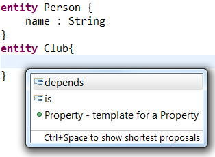
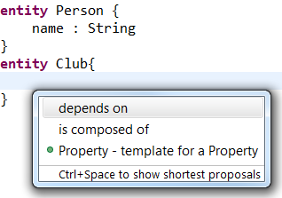

# Multiple Consecutive Keywords

Keywords play a central role in Xtext DSLs to define the languages general structure. In many cases a single keyword is sufficient to specify what is expected next. For example in the Xtext sample grammar used in this article the keyword "entity" introduces the definition of a new object of type *Entity*. However, in some cases there are multiple consecutive keywords required, e.g. if no single expressive word exists or if the statement should appear like a natural language sentence. Examples of the latter can be found in the blog articals regarding [controlled natural languages](https://blogs.itemis.com/en/xtext-and-controlled-natural-languages-for-software-requirements-part-1)  described by Christoph Knauf. Although, Xtext generally supports multiple consecutive keywords the default content assist implementation  will propose one keyword after another leading to rather confusing proposals. 

After demonstrating the problem with a simple Entity DSL it will be shown that slighty changing the grammar generates the infrastructure to offer more valuable proposals. The source code for this example is available in our [Github repository](https://github.com/itemis/itemis-blog/tree/multiple_keywords).

## Sample Grammar
As an example we will use the following small DSL that allows to define Entities that contain Properties and specific Relations. Each of the relations comes with its own semantic that is represented by a sequence of keywords. While *depends on* carries the semantic that one entity is relying on the existing of a certain other entity *is composed of* defines a composition dependency between two entities. Since it is considered good grammar style to put each keyword in its own quote the keyword sequences are separated. 

```
grammar org.eclipse.xtext.example.domainmodel.Domainmodel with org.eclipse.xtext.xbase.Xbase

generate domainmodel "http://www.xtext.org/example/Domainmodel"

DomainModel:
	importSection=XImportSection?
	elements+=Entity*;

Entity:
	'entity' name=ValidID ('extends' superType=JvmParameterizedTypeReference)? '{'
		properties+=Property*
		relations+=Relation*
	'}';

Relation:
	('depends' 'on' | 'is' 'composed' 'of') referencedEntity=[Entity]
;

Property:
name=ValidID ':' type=JvmTypeReference;
```
    
As an example we want to define an entity Person and an entity Club where the entity Club is *composed of* Persons. Within the entity Club the proposal provider is invoked leading to the following suggestions. 



The figure above shows the proposals based on the default implementation of the content assist that offers each first keyword of the *Relation* rule. In consequence each single keyword of the sequence will be proposed by an additional hit of CTRL + Space. Especially, the beginning of the second keyword sequence *is* gives no information about the whole keyword sequence making the proposal nearly unusable. To improve the suggestion of multiple consecutive keywords the grammar and the proposal provider will be slightly adjusted.

## Grammar Adjustments
To enable the proposal provider to make more valuable suggestions the keyword sequences are moved to their own parser rule that is than referenced from the *Relation* rule. 

```
Relation:
	(DependsOn | IsComposedOf) referencedEntity=[Entity]
;

DependsOn:
	'depends' 'on'
;

IsComposedOf:
	'is' 'composed' 'of'
;
```

Although, the change makes no difference to the grammar itself it causes valuable changes in the generated language framework and especially in the proposal provider. Each of the keyword sequences now has its own *complete_* method in the *AbstractDomainmodelProposalProvider*.

```java
	public void complete_DependsOn(EObject model, RuleCall ruleCall, ContentAssistContext context, ICompletionProposalAcceptor acceptor) {
		// subclasses may override
	}
	public void complete_IsComposedOf(EObject model, RuleCall ruleCall, ContentAssistContext context, ICompletionProposalAcceptor acceptor) {
		// subclasses may override
	}
```

As the by default generated methods suggest we now implement each of these in the *DomainmodelProposalProvider* to return the whole sequence of keywords as a proposal.

```xtend
class DomainmodelProposalProvider extends AbstractDomainmodelProposalProvider {
	
	@Inject extension DomainmodelGrammarAccess
	
	override complete_DependsOn(EObject model, RuleCall ruleCall, ContentAssistContext context, ICompletionProposalAcceptor acceptor) {
		dependsOnAccess.group.createKeywordProposal(context,acceptor)
	}
	override complete_IsComposedOf(EObject model, RuleCall ruleCall, ContentAssistContext context, ICompletionProposalAcceptor acceptor) {
		isComposedOfAccess.group.createKeywordProposal(context,acceptor)
	}
	
	def createKeywordProposal(Group group, ContentAssistContext context, ICompletionProposalAcceptor acceptor) {
		if (group == null) {
			return null
		}
		val proposalString = group.elements.filter(Keyword).map[value].join(" ") + " "
		acceptor.accept(createCompletionProposal(proposalString, proposalString, null, context))
	}
}
```

First, we inject the *DomainmodelGrammarAcces* as extension to the *DomainmodelProposalProvider*. Second, we overwrite the *complete_* methods as shown in the figure above. Third, the real magic for creating a coherent keyword sequence is implemented in the *createKeywordProposal* method that based on the keywords in the given group concatenates a string containing all of them separated by a single space. Finally, the concatenated keyword string is converted into a completion proposal. The result is shown in the following figure that show the newly created proposal strings that now contain the whole sequence of keywords.

 

## Conclusion
As demonstrated above the default keyword support of the Xtext language workbench is sufficient for single keywords. However, there are situations in which multiple consecutive keywords are required to define thorough and comprehensive language statements. To cope with sequences of keywords as a whole small changes to the grammar are required. In addition to solely proposing consecutive keywords the overwritten methods can also be used to filter, e.g. allow only one *depends on* relation per entity. All in all, the rather small changes to the grammar make the suggested consecutive keywords more valuable and in addition create new opportunities to improve the overall proposals.
  
