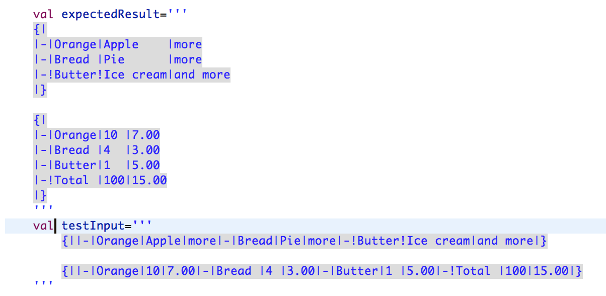

# Testing the Formatter
In a previous post [Formatter Introduction](https://www.itemis.de) I explained 
how the new formatter API works and how you can use it for the formatting of 
a Table. 
As TDD is an elemental concept in everyday software development, I now want to explain
how the formatter can be tested with some simple JUnit-Tests.

##Xtend-Templates
First of all I want to explain how the Xtend-Templates work and how we can take 
advantage of this concept for our unit tests. Xtend-Templates can be assigned to a 
variable and start with `'''` and also end with it. Inside these marks, you can
write text, which in the background converts to a String, but has all the formatting
available you gave inside the marks.
Lets take a look at an example:


Here we assigned an expected result to a variable called `expectedResult` which shows 
our table nicely formatted. This is how it should look like, if the formatter works well.
Below we have a variable called testInput, which shows the text completely unformatted.

##Unit-Tests in Xtext
If you use the wizard for creating an Xtext project, you can select the testing support.
Once selected, there are two projects created for testing purposes, `.tests`-project
and `.ui.tests`. Here we will concentrate on the `.tests` project.
Inside the package we will create a class called `FormattingTest.xtend`
and annotate it with 
```
@RunWith(XtextRunner)
@InjectWith(TableInjectorProvider)
```

These annotations enable the injector for this project, using the InjectorProvider of
the main xtext project and let the class run with a special runner, which aims at
testing purposes. 

Now we are ready to go and write our first Unit-Test for the formatter.

##Writing a first formatter test
Using the snippets you see in the picture above, we can now create the variables.
To make this test possible, we will inject the serializer and the Parser for our 
language using 
 
```
@Inject extension ParseHelper<Document> 
@Inject extension ISerializer
```

The parseHelper has the first EntryRule of our grammar in the brackets, because we
want to test the formatter for our whole grammar.
The ISerializer interface is injected to serialize or test input snippet, where the
formatter is automatically applied to any text given.

To create a test case using the example variables from above, we can simply write
the following:
```
@Test 
def void testFormatter() {
	assertEquals(expectedResult,
		testInput.parse.serialize(SaveOptions.newBuilder.format().getOptions()))
}
```

This is all we need for a first test case.

##Conclusion
Writing unit tests for the formatter is quite easy, once you have configured your test class. 
For larger tests you can consider giving the test input and output from a file,
because very large templates can get quite messy.

Happy testing!