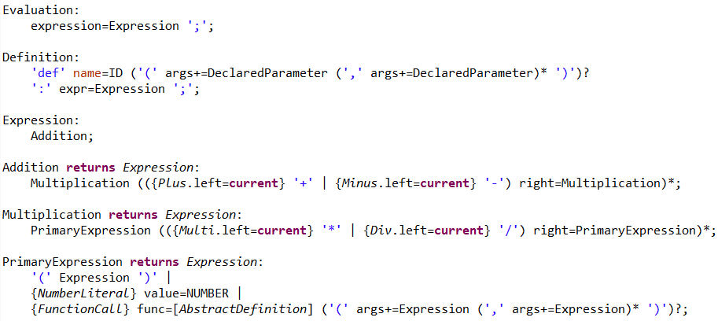
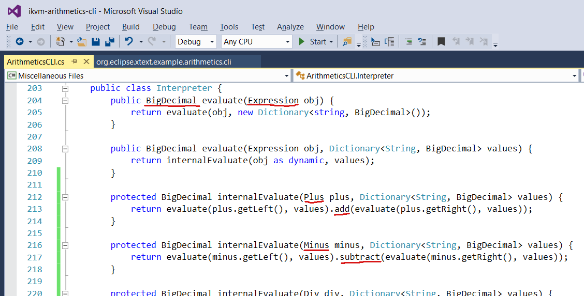

# Language development on .NET with Xtext   - Part 1: Overview
## Introduction
Developing a textual DSL in .NET is a tedious process consisting of manually defining data structures and writing a grammar with actions to construct syntax trees, symbol tables, basic validations and so on.

Xtext automatizes a a large part of the process of DSL creation:
By writing an Xtext grammar, one doesn't only get a parser and a serializer, but also abstract syntax trees and the corresponding classes, syntax validations and cross-references to other EMF models.
Apart from the generated classes, Xtext includes a runtime library which provides an extensive infrastructure of re-usable, customizable services for handling DSL models.

This blog series will illustrate the integration of a simple Xtext DSL within a .NET command-line application written in C# by using the Java-to-.NET translator IKVM.

In the first part of this series, we will give an overview of the example use case, a command-line calculator.

## Use case overview
To demonstrate the integration, we start with a DSL developed with Xtext, in this case a language for simple arithmetical expressions and functions.
A snippet of this language's grammar is listed below.

[//]: # "TODO: Herausgerissenes Blatt"

From the grammar, Xtext generates a parser which maps DSL instances to Java objects.
For example, the parser would map the expression ``1 + 2`` to an instance of the generated class ``Plus`` whose ``left`` and ``right`` properties are ``NumberLiteral``s with ``value = 1`` and ``value = 2``, respectively.

Now we will write a C# interpreter for evaluating the arithmetical expressions of our DSL and a command-line interface to the interpreter, in order to show that it's possible to embed Xtext DSLs in .NET applications by consuming them in C# programs and thus avoid most of the tedious work connected with parser development.

In order to realize this embedding, we first convert the DSL's generated Java classes and the runtime libraries to a .NET assembly.
To do this, we can build a Uber JAR containing all these classes and their dependencies using Maven and the Shade plugin, and then invoke IKVM from Maven to create a DLL from the JAR.
Then, we can reference this DLL from a C# project and use the classes originally written in Java in our C# application.

The figure above illustrates the integration of the Xtext DSL in C# - it shows a part of the interpreter, whose purpose is to evaluate an arithmetical expression (input parameter type ``Expression``), with a number (``BigDecimal``) as result.
In the ``evaluate`` method, we dispatch by expression class, such that for a ``Plus``, first the left and right summand are evaluated and the results are added with ``add``, and similarly for ``Minus`` and so on.

## Conclusion
In this post we have sketched a way of integrating Xtext developed DSLs into the .NET platform by using IKVM, which allows to consume Xtext generated classes in a C# program.
The following blog entries of this series will provide more detail regarding the creation of the .NET assembly and the integration into the C# application.

The example code is [available](https://github.com/stadlerb/ikvm-arithmetics-cli) on Github.
