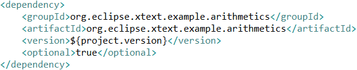

# Introduction
In the [first part](https://blogs.itemis.com/en/language-development-on-.net-with-xtext-part-1-overview) of this blog series we have introduced an example use case of integrating an Xtext DSL in a C# command-line calculator.
This post will go into the details of how to use Maven to create a .NET assembly containing the DSL and Xtext runtime classes necessary for writing the calculator application.
After starting with an overview of the project structure, we will focus on how to create a .NET assembly by first constructing a Uber JAR that includes all dependencies and then converting it to an assembly using IKVM.NET. 

The source code is [available](https://github.com/stadlerb/ikvm-arithmetics-cli) on GitHub.

# Project structure
As build tool, Xtext offers the choice between [Maven](https://maven.apache.org) and [Gradle](https://gradle.org).
In this example, Maven is employed as the Gradle build has only been added recently and the Maven build is more stable.

The basic project structure conforms to Xtext's default Maven layout and consists of the root project ``org.eclipse.xtext.example.arithmetics.parent`` and the Xtext DSL project ``org.eclipse.xtext.example.arithmetics``, which are generated by Xtext's New Project wizard.
The root project is used as a parent project to specify shared configuration items and serves as an aggregator project that provides a single build for all sub-projects.
The Xtext DSL project is essentially the Xtext Simple Arithmetics example, adapted for Maven and with a few improvements for the CLI calculator application.
The ``org.eclipse.example.arithmetics.dotnet`` project was manually created and is responsible for creating a .NET assembly (a ``dll`` file) that can be used to consume the DSL in C#.

The project structure consisting of the root project and the child projects ``org.eclipse.example.arithmetics`` and ``org.eclipse.example.arithmetics.dotnet`` is summarized in the figure below:

# Creating a .NET assembly for consuming the DSL in C#
Now that we have an overview of the project structure, we can direct our attention to the actual creation of the DLL, which consists of two steps: First creating a Uber JAR from all transitive dependencies of the ``org.eclipse.example.arithmetics.dotnet`` project using the Maven Shade plugin and then converting the Uber JAR to a DLL as the project's main artifact using IKVM.NET.

In the following subsections we will provide a more detailed description of the DLL creation process.

## Creating a Uber JAR with the Shade plugin
A Uber JAR is a JAR that includes a project and its direct and indirect dependencies and is produced by merging the JARs of the project and all its dependencies into a single, "fat" JAR.
In order to create a Uber JAR from the dependencies of the dotnet project, we include the Shade plugin in the POM of the project, which performs the merging of all Maven dependencies into a Uber JAR.

As shown in the figure above, we need to exclude the signature files from the creation of the Uber JAR, in order to avoid ``SecurityException``s that would be thrown at runtime because the signatures don't match anymore.
The ``<exclude>`` element for the the ``org.eclipse.example.arithmetics.dotnet`` project is added to prevent the Shade plugin from producing an error because it can't find the project's own JAR, which doesn't exist due to the ``pom`` packaging, which will be explained further below.

Now, in order to include the DSL project in the Uber JAR, we need to specify it as a dependency of the ``org.eclipse.example.arithmetics.dotnet`` project, as illustrated in the following figure:

The ``org.eclipse.example.arithmetics`` dependency is declared as optional because otherwise, the JARs of all of its dependencies would be downloaded unnecessarily when building Maven projects that depend on the ``org.eclipse.example.arithmetics.dotnet`` project.

## Converting the Uber JAR to a .NET assembly with IKVM
After creating the Uber JAR in the previous step, we can use IKVM.NET to convert the it to a .NET assembly.
As there is no currently maintained (or working) Maven plugin for IKVM.NET, we use the ``exec-maven-plugin`` in order to invoke the IKVM.NET compiler.

As a preparation for this to work, we need to download the [latest release of IKVM.NET](http://www.frijters.net/ikvmbin-8.1.5717.0.zip) and extract it to some location.
By default, we use the directory ``ikvm`` in the user's home folder, so that ``ikvmc.exe`` would be available under ``C:\Users\<username>\ikvm\bin\ikvmc.exe`` on Windows systems.
By defining the IKVM.NET location as a Maven property as illustrated below, this default location can be overridden using ``-Dikvm.home=<directory>`` later during the invocation of Maven: 

Based on this, we can specify the execution of ``ikvmc.exe`` using the ``exec`` goal of the ``exec-maven-plugin`` plugin. 

We specify the project's ``target`` directory as working directory and pass parameters to create a dll from the JAR.

## .NET Assembly as Maven artifact
As the DLL is the ``org.eclipse.example.arithmetics.dotnet`` project's main artifact, but Maven has no built-in support specific for .NET assemblies, we have to use a workaround:
We specify the project's packaging to be ``pom``, which means that technically the ``pom.xml`` itself is the project's primary artifact, and then use the the ``attach-artifact`` goal of the ``build-helper-maven-plugin`` to tell Maven to attach the DLL as a supplementary artifact.
This way, the DLL gets installed in the Maven repository when the Maven ``install`` goal is built and can be used by other projects by adding ``<type>dll</type>`` to the dependency declaration.

The resulting plugin configuration is illustrated below:

## Debug profile
In order to facilitate debugging applications, IKVM.NET supports generating [PDB files](msdn.microsoft.com/library/ms241613.aspx).
As we want to be able to deactivate their generation on demand, we create a profile ``dotnet-debug`` which adds the ``-debug`` command line option and attaches the resulting PDB file as a project artifact.
For the detailed configuration of the profile, please refer to GitHub.

## Running the build
Now, we can run the build using the MS Build command prompt from the parent directory:

        mvn clean install

There may be several warnings regarding missing classes, which can be safely ignored.
The resulting DLL will be placed in the ``target`` directory.

# Conclusion
In this part of the series, we have described how to transform an Xtext DSL project into a .NET assembly which is ready for use in a C# application.
The next blog entry will demonstrate how to use this assembly to create a command-line calculator application.