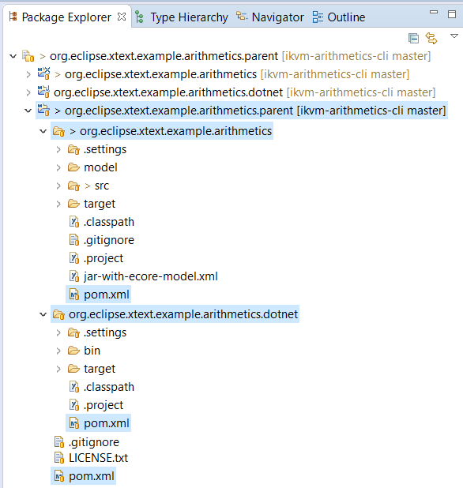
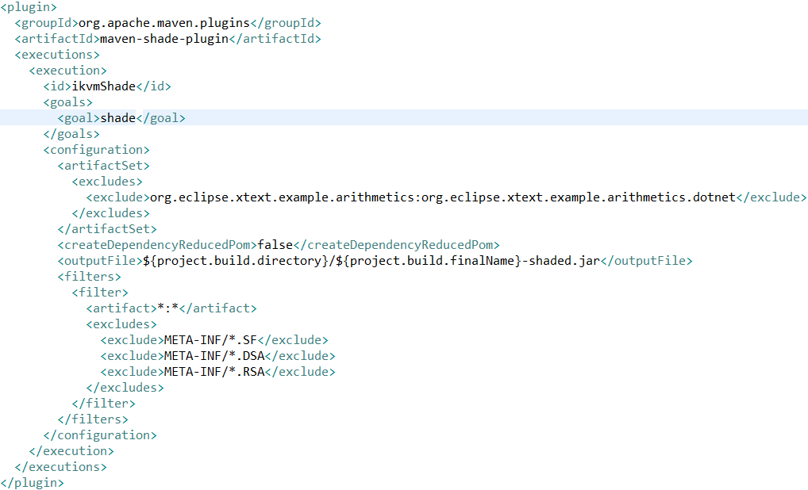
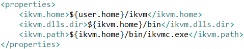
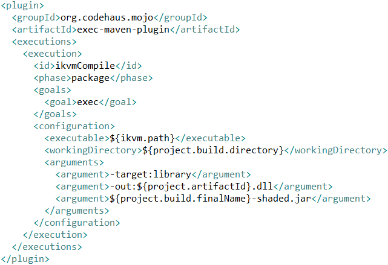
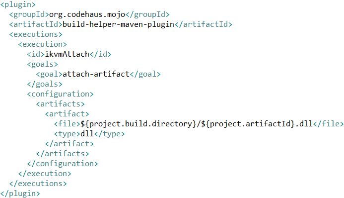

# Language development on .NET with Xtext Part 2: Creating a .NET assembly from an Xtext DSL
## Introduction

## Project structure

## Creating an Uber JAR with the Shade plugin

## Converting the Uber JAR to a .NET assembly with IKVM

## Conclusion
